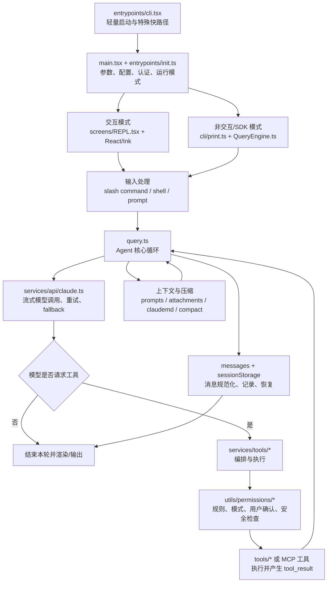

# Claude Code 2.1.88 源码学习地图

> 本仓库用于学习 Claude Code 客户端的工程架构，并为后续按模块生成源码解析课程提供统一地图。

## 先说结论

这不是 Rust 项目。当前快照中的 Claude Code 客户端主要由 **TypeScript / TSX** 编写，打包后运行于 Bun/Node.js 兼容环境，终端界面采用 React + Ink 风格的组件体系。仓库保存的是 npm 发布包中的关键文件、source map 还原材料、可读源码，以及配套课程和已有的中英文分析文档；它不是 Anthropic 官方内部 monorepo 的原始目录。

因此，本仓库采用两套视角：

- **物理目录**：说明文件现在放在哪里、怎样得到可阅读源码。
- **学习分区**：按职责和调用链重新组织知识，但不移动或改写还原源码。

后续课程默认面向“不熟悉 TypeScript/Rust、熟悉或愿意阅读 Python”的学习者。讲解以流程、数据结构、状态变化和设计取舍为主；必须展示实现时，优先给最小 TypeScript 片段，并提供等价 Python 伪实现。详细约束见 [AGENTS.md](./AGENTS.md)。

## 仓库内容与可信边界

```text
ClaudeCode/
├── README.md                         # 本文：总览、分区、阅读路线
├── AGENTS.md                         # 后续课程生成 Agent 的统一规范
├── claude-code-sourcemap/
│   ├── extract-sources.js            # 从 source map 提取 sourcesContent
│   ├── package/
│   │   ├── cli.js                    # 可执行的单文件构建产物
│   │   ├── cli.js.map                # 主要研究材料
│   │   ├── package.json              # npm 元数据，版本 2.1.88
│   │   └── sdk-tools.d.ts            # 对外工具类型声明
│   └── restored-src/
│       ├── src/                      # source map 还原出的自有可读源码
│       └── vendor/                   # source map 中的少量 vendor 源码
├── courses/                          # P00–P13 中文源码解析课程
└── claude-code-docs/
    ├── README.md                     # 已有专题文章索引
    └── docs/                         # 13 个主题，中英文各一份
```

本次盘点直接读取 `cli.js.map` 的 `sources` 与 `sourcesContent`，得到以下快照数据：

| 项目 | 数量 |
|---|---:|
| source map 中的全部来源文件 | 4,756 |
| `../src/` 下的 Claude Code 自有文件 | 1,902 |
| 自有 TS/TSX 文件 | 1,884 |
| 自有源码约计行数 | 514,587 |
| npm/CLI 自报版本 | 2.1.88 |
| 构建时间（构建产物内元数据） | 2026-03-30 |

注意以下边界：

1. source map 同时包含大量 `node_modules` 源码，不能把 4,756 个文件都算作 Claude Code 自有实现。
2. source map 是打包输入的快照，可能包含通过 `feature('...')` 在外部构建中裁剪掉的代码路径。看到源码不等于该功能在 2.1.88 公共构建中可用。
3. source map 不等于原始仓库。测试、构建脚本、内部服务端、模型实现、提交历史和部分 feature-gated 模块可能缺失。
4. 客户端负责交互、上下文、工具、权限和会话编排；真正的模型推理由远端 API 完成。
5. `claude-code-docs/` 是很有价值的二手解读，但课程结论仍应回到当前 source map 逐项核对。

## 如何得到可阅读源码

源码正文嵌在 `claude-code-sourcemap/package/cli.js.map` 的 `sourcesContent` 中。仓库已经提供提取脚本：

```bash
cd claude-code-sourcemap
node extract-sources.js
```

成功后重点阅读：

```text
claude-code-sourcemap/restored-src/src/
```

而不是：

```text
claude-code-sourcemap/restored-src/node_modules/
```

如果运行时提示缺少 `source-map`，是因为提取脚本声明了该模块；安装它后重试即可。提取出的源码主要用于静态阅读。发布包本身可直接确认版本：

```bash
node claude-code-sourcemap/package/cli.js --version
```

不要一开始就尝试“把还原源码重新构建起来”。source map 没有承诺包含完整 monorepo、宏定义、内部依赖和构建配置；对初学者而言，先沿调用链做静态分析更可靠。

## 一张图理解系统



这里有一个容易误读的细节：`QueryEngine` 目前明确服务于 headless/SDK 会话；交互式 `REPL.tsx` 仍直接调用 `query()`。两条入口最后共享同一个 Agent 循环，但上层生命周期并未完全统一。

## 核心运行链路

一次普通自然语言请求可以压缩成下面十步：

1. `src/entrypoints/cli.tsx` 先处理 `--version`、MCP host、remote-control 等快路径，再动态加载主程序。
2. `src/main.tsx` 建立 Commander 命令树，判断 TTY、`--print`、SDK、远程等运行模式。
3. `src/entrypoints/init.ts` 初始化配置、安全环境、认证、遥测及平台能力。
4. 交互模式进入 `src/screens/REPL.tsx`；打印/SDK 路径进入 `src/cli/print.ts` 与 `src/QueryEngine.ts`。
5. 输入处理层区分自然语言、slash command、本地 shell 输入和附件，并组装本轮消息。
6. `src/query.ts` 规范化消息、补充用户/系统上下文，检查 token 与压缩条件，然后发起流式模型请求。
7. `src/services/api/claude.ts` 负责请求参数、模型/provider、流式事件、缓存、重试与错误映射。
8. 模型返回 `tool_use` 后，`src/services/tools/` 查找工具、调度并产出进度；`src/utils/permissions/` 与工具自己的校验器共同决定是否允许执行。
9. 工具结果转成 `tool_result` 回填消息，`query()` 继续下一次模型调用，直到结束、被中断、超预算、达到轮数限制或不可恢复错误。
10. UI/结构化输出消费生成器事件；`src/utils/sessionStorage.ts` 写入 transcript，支持恢复、分支和子 Agent 记录。

理解这条链路时，最重要的抽象不是某个框架名，而是三个相互嵌套的状态机：

- **进程状态机**：CLI 快路径、交互、打印、SDK、MCP、远程模式。
- **会话状态机**：历史消息、配置、权限、文件缓存、用量、持久化。
- **本轮 Agent 状态机**：调用模型、解析流、执行工具、压缩、继续或终止。

## 面向课程的源码分区

以下分区是后续课程的稳定编号。一个源码目录可以出现在多个分区，但每门课必须有一个主归属，并说明跨区依赖。

| 编号 | 学习分区 | 主要源码范围 | 核心问题 | 前置 |
|---|---|---|---|---|
| P00 | 快照与阅读方法 | `cli.js.map`、`extract-sources.js`、`package.json`、`sdk-tools.d.ts` | source map 还原了什么、没还原什么；如何区分自有源码和依赖 | 无 |
| P01 | 启动、初始化与运行模式 | `entrypoints/`、`main.tsx`、`bootstrap/`、`cli/handlers/` | `claude` 如何启动；交互、print、SDK、MCP、remote 如何分流 | P00 |
| P02 | 终端 UI 与输入系统 | `screens/REPL.tsx`、`components/`、`ink/`、`hooks/`、`context/`、`keybindings/`、`vim/` | 流式消息怎样显示；输入、快捷键、弹窗和权限确认怎样协作 | P01 |
| P03 | 消息模型、会话与恢复 | `utils/messages.ts`、`utils/sessionStorage.ts`、`history.ts`、`state/`、SDK schemas | 消息如何配对、规范化、落盘、恢复、分支；UUID 如何串起因果链 | P01 |
| P04 | Agent 核心循环 | `query.ts`、`query/`、`QueryEngine.ts`、`utils/processUserInput/` | 一轮怎样循环；AsyncGenerator 为什么合适；继续与停止条件是什么 | P03 |
| P05 | 模型 API 与流式协议 | `services/api/`、`utils/model/`、`utils/tokens.ts`、`cost-tracker.ts` | 请求如何构造；流事件怎样变成内部消息；重试、fallback、预算如何工作 | P04 |
| P06 | 上下文、Prompt、记忆与压缩 | `constants/prompts.ts`、`context.ts`、`utils/context.ts`、`utils/contextAnalysis.ts`、`utils/attachments.ts`、`utils/claudemd.ts`、`utils/memory/`、`services/compact/`、`services/SessionMemory/`、`services/extractMemories/` | 模型每轮看到什么；CLAUDE.md/记忆何时注入；上下文满了怎么办 | P03、P04 |
| P07 | 工具抽象与执行流水线 | `Tool.ts`、`tools.ts`、`tools/`、`services/tools/` | 工具 schema、校验、权限、执行、进度和结果如何组成统一协议 | P04 |
| P08 | 权限、安全与沙箱 | `utils/permissions/`、`utils/sandbox/`、`tools/BashTool/`、`tools/PowerShellTool/`、`hooks/toolPermission/`、`components/permissions/` | allow/ask/deny 如何决策；路径与命令怎样防护；模式如何切换 | P07 |
| P09 | 命令、配置与 Hook | `commands.ts`、`commands/`、`utils/settings/`、`utils/config.ts`、`utils/hooks.ts`、`utils/hooks/`、`components/hooks/` | slash command 与工具有何不同；设置来源如何合并；生命周期扩展点在哪里 | P01、P03 |
| P10 | MCP、Skill 与 Plugin 扩展 | `services/mcp/`、`tools/MCPTool/`、`skills/`、`tools/SkillTool/`、`plugins/`、`utils/plugins/`、`services/plugins/` | 外部工具如何发现与连接；Skill 如何加载；Plugin 如何组合命令、Agent、Hook、MCP | P07、P09 |
| P11 | 子 Agent、任务与多 Agent | `tools/AgentTool/`、`tools/shared/spawnMultiAgent.ts`、`tasks/`、`utils/forkedAgent.ts`、`utils/swarm/`、`coordinator/`、`tools/SendMessageTool/` | 子 Agent 如何继承上下文、隔离历史、并行执行和通信；任务怎样后台化 | P04、P07、P08 |
| P12 | 远程、Bridge 与外部客户端 | `remote/`、`bridge/`、`cli/transports/`、`cli/structuredIO.ts`、`server/`、`entrypoints/sdk/` | 本地 Agent 如何被 SDK、桌面端或远程会话驱动；事件和权限怎样跨边界传输 | P03、P04、P11 |
| P13 | 认证、平台与可观测性 | `utils/auth.ts`、`services/oauth/`、`services/analytics/`、`utils/telemetry/`、`utils/platform.ts`、`native-ts/`、`migrations/` | 多后端认证、策略、日志、指标、升级与平台差异如何支撑主链路 | P01、P05 |

### 各分区的边界说明

- `utils/` 很大，不应单独成为一门“工具函数课”。其中的文件必须按业务职责归入 P03–P13。
- `components/` 和 `hooks/` 既有通用 UI，也有权限、MCP、任务等业务 UI。课程只在 P02 讲渲染机制，业务对话框回到对应分区讲。
- Bash/PowerShell 的解析和安全校验同时属于工具与安全。P07 讲调用契约，P08 讲策略与威胁模型，避免重复逐行解释。
- Feature flag 是横切机制。每门课记录本区相关 flag；最后可在 P13 做汇总，但不能把“存在源码”推导成“已上线功能”。
- `node_modules/`、生成代码和 vendor 二进制默认不纳入主课程，只有解释协议或平台边界时才作为附录。

## 推荐学习路线

不要按目录字母顺序读，也不要从 4,684 行的 `main.tsx` 第一行硬啃到最后一行。

### 第一阶段：建立最小闭环

按 `P00 → P01 → P03 → P04 → P07` 学习。完成后应能回答：

- 用户输入从哪里进入？
- 消息如何进入模型，又如何从流中返回？
- 模型为什么能调用工具？
- 工具结果为什么会触发下一轮模型调用？
- 会话在哪里保存？

### 第二阶段：理解 Claude Code 的工程价值

按 `P05 → P06 → P08 → P09 → P10` 学习。重点理解 API 稳定性、上下文工程、安全边界和扩展机制，而不是记函数名。

### 第三阶段：理解产品化与规模化

按 `P02 → P11 → P12 → P13` 学习。这里涉及终端 UI、并发子 Agent、远程控制、多客户端协议和可观测性，适合在核心闭环清楚之后阅读。

## 第一批锚点文件

| 文件 | 作用 | 阅读建议 |
|---|---|---|
| `src/entrypoints/cli.tsx` | 轻量 bootstrap 与快路径 | 先读，文件短且能看清为何动态 import |
| `src/main.tsx` | CLI 参数、模式分流和产品级胶水 | 只沿目标分支跳读，不逐行通读 |
| `src/entrypoints/init.ts` | 全局初始化 | 用“初始化顺序与副作用”视角阅读 |
| `src/screens/REPL.tsx` | 交互式会话主界面 | P02 再读；先定位调用 `query()` 的位置 |
| `src/QueryEngine.ts` | headless/SDK 会话生命周期 | 对照 REPL，观察共享与未共享部分 |
| `src/query.ts` | Agent 循环核心 | 先画状态转换，再看错误与压缩分支 |
| `src/query/config.ts`、`src/query/deps.ts` | 循环配置与可替换依赖 | 用它们拆开核心流程和外围服务 |
| `src/services/api/claude.ts` | 模型请求与流式 API | 只追踪一条 provider 的成功路径起步 |
| `src/Tool.ts` | 工具协议与类型抽象 | 关注输入、校验、权限、执行、结果五部分 |
| `src/tools.ts` | 内置工具池组装 | 观察 feature flag、deny rule 和 MCP 合并点 |
| `src/services/tools/toolExecution.ts` | 单次工具执行 | 与 `Tool.ts`、权限模块一起读 |
| `src/services/tools/toolOrchestration.ts` | 多工具调度 | 关注并行条件、进度和取消 |
| `src/utils/permissions/permissions.ts` | 权限决策主逻辑 | 先整理决策顺序，后看具体规则 |
| `src/utils/messages.ts` | 消息创建、规范化和流处理 | 超大文件，按函数调用点检索阅读 |
| `src/utils/sessionStorage.ts` | transcript、恢复与分支 | 超大文件，先读写入与恢复两条路径 |
| `src/constants/prompts.ts` | system prompt 组装 | 区分静态规则与动态注入 |
| `src/utils/claudemd.ts` | CLAUDE.md 发现与加载 | 与附件、记忆、设置来源一起读 |
| `src/services/compact/` | micro/auto/full/session-memory 压缩 | 先比较触发条件和输出，再看 prompt |
| `src/services/mcp/client.ts` | MCP 客户端核心 | 在工具协议清楚后再读 |
| `src/tools/AgentTool/runAgent.ts` | 子 Agent 执行循环 | 对照主 `query()` 找继承与隔离边界 |

## TypeScript 概念的 Python 对照

课程不是 TypeScript 语法课。遇到下面概念时用 Python 心智模型快速翻译：

| TypeScript/React 概念 | Python 对照 | 在本项目中的含义 |
|---|---|---|
| `type` / `interface` | `TypedDict`、`Protocol`、`dataclass` | 消息、配置、工具上下文的形状约束 |
| 泛型 `Tool<I, O>` | `Generic[I, O]` | 保持工具输入输出类型对应 |
| `async function*` / `AsyncGenerator` | `async def` + `yield` / `AsyncIterator` | 一边执行一边发出 token、消息和工具进度 |
| discriminated union | 带 `kind/type` 字段的 dataclass 联合 | 用 `message.type` 安全分派事件 |
| `AbortController` | `asyncio.Event` 或任务取消 | 中断模型请求和工具执行 |
| React component | 返回 UI 描述的函数 | Ink 把组件树渲染到终端，而不是浏览器 DOM |
| React Context | `contextvars` 或显式依赖容器 | 在组件树共享会话/UI 状态 |
| hook (`useXxx`) | 状态机 + 回调封装 | 复用输入、权限、远程连接等有状态逻辑 |
| Zod schema | Pydantic model / JSON Schema | 运行时校验工具输入和配置 |
| `Promise.all` | `asyncio.gather` | 并行预取、连接或执行安全的独立任务 |

Python 对照只帮助理解，不应声称与 TypeScript 实现逐语义等价。例如 JavaScript 事件循环、React 重渲染和 Bun 的构建期 `feature()` 都有自己的运行时特性。

## 后续课程应产出什么

每个分区后续可以拆成若干课，但一课只解决一个清晰问题。建议每课包含：

1. 学习目标和前置知识。
2. 本课在总调用链中的位置。
3. 一条可验证的主流程。
4. 关键状态/数据结构，而不是完整类型抄录。
5. 2–6 个源码锚点及其职责。
6. 最小 TypeScript 摘录；语法复杂时给 Python 等价实现。
7. 一个简化实验、追踪题或状态机练习。
8. 设计取舍、失败路径、安全边界与版本限制。
9. 本课小结、检查题和下一课衔接。

完整的 Agent 执行规则、证据标准、命名方式与验收清单见 [AGENTS.md](./AGENTS.md)。

## 已有资料如何使用

`claude-code-docs/docs/` 已覆盖架构、Agent 循环、上下文、压缩、权限、记忆、工具、Skill 和 MCP，可作为预读材料或观点来源。使用时遵守两条原则：

- 当前 source map 是事实证据，已有文章是解释材料；两者冲突时记录版本差异并以快照为准。
- 已有文章偏专题纵深，本 README 的 P00–P13 偏课程依赖图；后续课程不要简单改写旧文章。

## 法律与安全提醒

本仓库中的还原源码和发布包版权归其权利人所有，仅应用于研究与学习。不要重新发布私有实现、移除许可声明或将其包装为官方源码。分析 Bash、PowerShell、权限绕过、远程控制或认证模块时，只做防御性解释，不提供绕过产品安全边界的操作指南。
