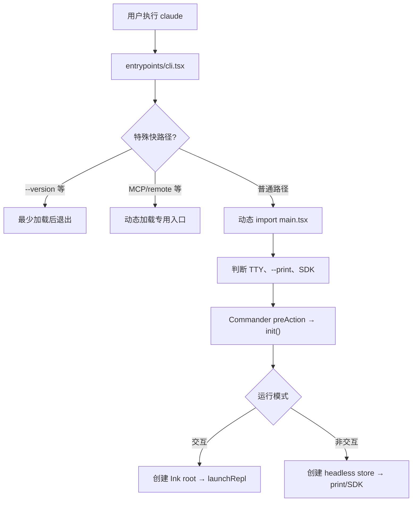

# P01 启动、初始化与运行模式

> `claude` 不是一启动就加载整个 Agent；它先走轻量分流，再按交互、打印、SDK、MCP 或远程模式加载不同系统。

## 学习目标

- 理解 `entrypoints/cli.tsx → main.tsx → init.ts` 的职责边界；
- 解释 `--version` 为什么不加载完整 CLI；
- 看懂 TTY、`--print`、SDK URL 如何决定交互模式；
- 区分同步初始化、必须等待的初始化和后台预热；
- 理解“信任建立前只应用安全配置”的安全顺序。

## 前置知识与范围

前置：P00。

本课讲进程从启动到选择运行模式，不深入 REPL 渲染、消息结构、Agent 循环和具体认证协议。它们分别属于 P02–P05、P13。

阅读约定：源码块会在不改变所讲控制流的前提下省略日志、类型和相邻分支；需要逐字核验时以紧邻的源码锚点为准。

## 在整体架构中的位置



这是一种“两级入口”设计：bootstrap 关心启动成本和特殊模式，`main.tsx` 关心完整产品配置。

## 先用 Python 建立最小模型

教学简化版：

```python
import sys

async def bootstrap(argv: list[str]) -> None:
    if argv in (["--version"], ["-v"]):
        print("2.1.88 (Claude Code)")
        return

    if argv[:1] == ["--some-special-server"]:
        await run_special_server(argv[1:])
        return

    await full_cli(argv)

async def full_cli(argv: list[str]) -> None:
    non_interactive = "--print" in argv or not sys.stdout.isatty()
    await initialize(non_interactive)
    if non_interactive:
        await run_headless(argv)
    else:
        await run_repl(argv)
```

关键不是语法，而是 **先分流、后重载**：昂贵模块只在需要时 import。

## Claude Code 的真实实现流程

### 1. `entrypoints/cli.tsx` 先处理零依赖快路径

源码锚点：[entrypoints/cli.tsx: main](../claude-code-sourcemap/restored-src/src/entrypoints/cli.tsx#L33)

```typescript
async function main(): Promise<void> {
  const args = process.argv.slice(2)

  if (args.length === 1 &&
      (args[0] === '--version' || args[0] === '-v' || args[0] === '-V')) {
    console.log(`${MACRO.VERSION} (Claude Code)`)
    return
  }

  const { profileCheckpoint } =
    await import('../utils/startupProfiler.js')
  profileCheckpoint('cli_entry')
}
```

解读：

- `process.argv.slice(2)` 去掉 Node 可执行文件和脚本路径；
- `MACRO.VERSION` 在构建时写入，不需要加载配置系统；
- profiler 也延迟到快路径之后加载；
- `return` 结束 bootstrap，不进入 `main.tsx`。

这是启动性能设计，而不是业务功能设计。`--version` 不应因为认证、插件或网络配置变慢。

### 2. 特殊模式使用动态 import

入口还会在完整 CLI 之前处理 Chrome MCP host、computer-use MCP、remote-control 等路径。普通路径最后才加载主模块：

```typescript
const { startCapturingEarlyInput } =
  await import('../utils/earlyInput.js')
startCapturingEarlyInput()

const { main: cliMain } = await import('../main.js')
await cliMain()
```

解读：

- 动态 import 把模块求值推迟到确认需要之后；
- `startCapturingEarlyInput()` 在大模块加载期间缓存用户提前输入，改善体感；
- 特殊 server 不需要先加载 React UI 和整个命令树。

部分特殊路径受 `feature('...')` 控制。源码存在属于等级 B，是否进入公共 bundle必须另查。

### 3. `main.tsx` 决定交互性

源码锚点：[main.tsx: main](../claude-code-sourcemap/restored-src/src/main.tsx#L585)

```typescript
const cliArgs = process.argv.slice(2)
const hasPrintFlag = cliArgs.includes('-p') || cliArgs.includes('--print')
const hasInitOnlyFlag = cliArgs.includes('--init-only')
const hasSdkUrl = cliArgs.some(arg => arg.startsWith('--sdk-url'))
const isNonInteractive =
  hasPrintFlag || hasInitOnlyFlag || hasSdkUrl || !process.stdout.isTTY

if (isNonInteractive) stopCapturingEarlyInput()
setIsInteractive(!isNonInteractive)
initializeEntrypoint(isNonInteractive)
```

解读：

- `--print` 明确要求一次性输出；
- `--init-only` 不需要 REPL；
- SDK transport 是机器驱动，不是终端交互；
- stdout 不是 TTY 时，即使没有 `--print` 也按非交互处理；
- 运行模式必须在遥测和认证初始化前写入全局状态，否则后续模块会做错假设。

### 4. Commander 只在真正执行命令时初始化

`main.tsx: run()` 建立 Commander 命令树，并使用 `preAction`：

```typescript
program.hook('preAction', async () => {
  await Promise.all([
    ensureMdmSettingsLoaded(),
    ensureKeychainPrefetchCompleted(),
  ])
  await init()
})
```

解读：显示 `--help` 不必完成所有初始化；真正执行 action 前，才等待会影响配置/凭据正确性的预取，并调用 `init()`。

### 5. `init()` 是幂等的初始化屏障

源码锚点：[entrypoints/init.ts: init](../claude-code-sourcemap/restored-src/src/entrypoints/init.ts#L57)

```typescript
export const init = memoize(async (): Promise<void> => {
  enableConfigs()
  applySafeConfigEnvironmentVariables()
  applyExtraCACertsFromConfig()
  setupGracefulShutdown()

  void populateOAuthAccountInfoIfNeeded()
  void initJetBrainsDetection()
  void detectCurrentRepository()
})
```

解读：

- `memoize` 让多个调用者共享同一个初始化 Promise，避免重复副作用；
- 配置系统先启用，但信任对话框前只应用安全环境变量；
- CA 证书必须在第一次 TLS 握手前设置；
- graceful shutdown 必须早注册，保证缓冲写入有机会 flush；
- OAuth 信息补齐、IDE 检测、GitHub 仓库检测可以后台开始，不阻塞主路径。

这里同时存在三类初始化：

| 类型 | 示例 | 为什么 |
|---|---|---|
| 必须按顺序完成 | 配置启用、安全环境变量、CA | 后续模块依赖正确环境 |
| 必须在 action 前等待 | MDM settings、keychain prefetch | 影响策略和认证 |
| fire-and-forget | IDE/仓库检测、部分遥测 | 只为后续缓存，不应拖慢首屏 |

### 6. 交互和非交互创建不同上层运行环境

非交互分支会创建 headless store、连接本轮需要的 MCP、应用 print 模式配置，然后交给打印/SDK路径。交互分支会创建 Ink root，处理 onboarding、信任和恢复选择，再 `launchRepl(...)`。

这两条路径的核心差异：

| 维度 | 交互 REPL | print/headless/SDK |
|---|---|---|
| 输出目标 | Ink 终端组件树 | text/json/stream-json |
| 用户确认 | 可显示对话框 | 不能依赖交互弹窗 |
| 上层状态 | React/AppState store + REPL hooks | headless store + QueryEngine/print |
| 生命周期 | 多轮长期会话 | 常见为一次性或外部驱动 |
| Agent 核心 | 最终调用 `query()` | 最终也调用 `query()` |

## 关键状态与所有权

| 状态 | 所有者 | 生命周期 |
|---|---|---|
| `process.argv` | Node 进程 | 整个进程；部分入口会重写 |
| `isInteractive` | bootstrap/global state | 进程模式 |
| `CLAUDE_CODE_ENTRYPOINT` | 环境/全局配置 | 标识 cli、sdk、desktop 等客户端 |
| Commander program | `main.tsx: run()` | 命令解析阶段 |
| 初始化 Promise | memoized `init()` | 进程内只执行一次 |
| Ink root | 交互主路径 | REPL UI 生命周期 |
| headless store | 非交互 action | SDK/print 会话生命周期 |

## 失败路径、安全边界与设计取舍

### 信任边界

`init()` 先 `applySafeConfigEnvironmentVariables()`，完整环境变量在建立信任后应用。print 模式会绕过信任对话框，源码和 CLI 帮助都把其工作目录视为调用者已信任；自动化脚本不应在未知目录盲目运行 `claude -p`。

### 初始化失败

组织策略校验、配置错误、认证限制等会在进入 REPL/API 前输出错误并结束。正确设计是尽早失败，避免 UI 已启动或工具已运行后才发现策略不允许。

### 退出与缓冲

初始化早期注册 graceful shutdown，因为会话、日志和遥测可能使用批量/延迟写入。直接 `process.exit()` 的特殊路径必须明确知道是否需要额外清理。

### 性能取舍

动态 import、后台预取和不阻塞 REPL 的插件维护提升启动速度，但也增加初始化时序复杂度。源码中大量注释是在记录“哪些 Promise 必须 await，哪些只能后台运行”。

## 源码锚点

| 文件/符号 | 在流程中的职责 | 建议关注 |
|---|---|---|
| `src/entrypoints/cli.tsx: main` | bootstrap 与特殊快路径 | 动态 import、构建期开关 |
| `src/main.tsx: main` | 进程模式与客户端类型 | TTY、argv 重写、入口标识 |
| `src/main.tsx: run` | Commander 命令树 | `preAction`、options、action 分流 |
| `src/entrypoints/init.ts: init` | 全局初始化屏障 | 顺序、副作用、后台任务 |
| `src/ink.ts: createRoot` | 创建交互 UI 根 | 只在交互模式加载 |
| `src/cli/print.ts` | 非交互执行与格式化 | P03/P04 再沿消息流阅读 |

## 动手练习

1. 运行 `cli.js --version`，再在入口中解释它没有加载哪些系统。
2. 画出 `claude -p` 和普通 `claude` 从 `main()` 开始的第一处分叉。
3. 在 `init.ts` 中各找一个必须 await 和 fire-and-forget 的初始化，解释选择原因。
4. 假设 stdout 被 pipe 到文件，即使没有 `--print`，系统会选择哪种模式？

## 小结与检查题

Claude Code 的启动架构可以概括为：**轻入口做快路径与模式裁剪，重入口做配置和产品分流，memoized init 提供有序初始化屏障**。

自检：

1. 为什么 profiler 也放在 `--version` 分支之后加载？
2. `!process.stdout.isTTY` 为什么会影响运行模式？
3. 为什么不能把所有初始化都放进一个 `await Promise.all(...)`？
4. 交互和 headless 两条路径最终共享的核心是什么？

## 版本与证据说明

- 快照：2.1.88。
- `--version`、TTY/print 分流、`init()` 顺序：证据等级 A。
- `feature('...')` 保护的特殊 server/内部模式：证据等级 B，不能仅据源文件断言公共版本启用。
- 本课只描述客户端启动，不代表服务端会话初始化逻辑。
