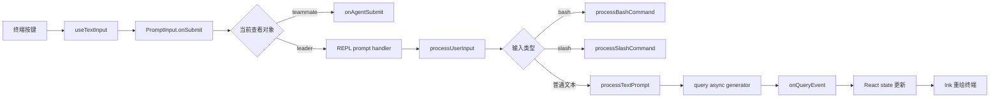

# P02 终端 UI 与输入系统

> Claude Code 的交互界面不是“循环执行 input()”，而是 React 状态、Ink 终端渲染、输入 hook 和异步 Agent 事件共同驱动的 UI 状态机。

## 学习目标

- 理解 React + Ink 如何把组件树渲染到终端；
- 区分全局 AppState、REPL 局部状态和输入组件内部状态；
- 追踪一次 Enter 从 `PromptInput` 到 `processUserInput()` 再到 `query()`；
- 理解普通 prompt、slash command、bash mode 和远程输入的分流；
- 看懂流式事件如何更新 UI，而不把半成品消息当成最终历史。

## 前置知识与范围

前置：P00、P01。

本课关注交互主线程。消息持久化属于 P03，Agent 循环属于 P04，工具权限对话框的安全决策属于 P08。

阅读约定：为避免复制超大 React 组件，源码块只保留目标 hook 或分支的关键语句；删去的 props、埋点和 UI 分支不改变本节结论。

## 在整体架构中的位置



## 先用 Python 建立最小模型

教学简化版用两个队列表示输入和输出事件：

```python
import asyncio
from dataclasses import dataclass

@dataclass
class UIState:
    input_text: str = ""
    streaming_text: str = ""
    messages: list[str] = None

    def __post_init__(self):
        self.messages = self.messages or []

async def submit(text: str, state: UIState) -> None:
    state.input_text = ""
    async for event in route_and_query(text):
        if event["type"] == "text_delta":
            state.streaming_text += event["text"]
        elif event["type"] == "message_complete":
            state.messages.append(event["text"])
            state.streaming_text = ""
        render_terminal(state)
```

真实实现不是每次手工调用 `render_terminal`。React state/store 改变后，Ink 会重新计算组件树并更新终端。

## Claude Code 的真实实现流程

### 1. REPL 是长期存在的会话组件

源码锚点：[screens/REPL.tsx: REPL](../claude-code-sourcemap/restored-src/src/screens/REPL.tsx#L572)

```typescript
export function REPL({
  commands: initialCommands,
  initialTools,
  initialMessages,
  pendingHookMessages,
  mcpClients: initialMcpClients,
  onBeforeQuery,
  onTurnComplete,
  thinkingConfig,
}: Props): React.ReactNode {
  const toolPermissionContext =
    useAppState(s => s.toolPermissionContext)
  const mcp = useAppState(s => s.mcp)
  const setAppState = useSetAppState()
}
```

解读：

- Props 是挂载时注入的会话依赖和初始值；
- `useAppState(selector)` 只订阅所需全局状态片段，相关片段改变才触发重渲染；
- `setAppState` 是全局 store 写入口；
- REPL 同时还使用大量 `useState`、`useRef` 和自定义 hook 管理局部 UI 状态。

### 2. 三种状态不要混为一谈

| 状态类型 | 例子 | 为什么放这里 |
|---|---|---|
| AppState/store | 权限上下文、MCP 连接、任务、插件 | 多组件/工具执行共同访问 |
| REPL 局部 state | 当前 screen、流式文本、弹窗状态 | 只服务当前界面生命周期 |
| `useRef` | 最新消息、AbortController、性能采样 | 跨 render 保留，但更新不必触发 render |
| PromptInput 内部 state | 光标、补全、footer selection、粘贴图片 | 高频输入状态，避免污染全局 store |

React 的 render 函数可能频繁执行，因此源码会把环境变量解析等不变工作放入 `useMemo`，把最新状态镜像到 ref，避免异步闭包读到旧值。

### 3. `useTextInput` 把按键变成编辑动作

源码锚点：[hooks/useTextInput.ts: useTextInput](../claude-code-sourcemap/restored-src/src/hooks/useTextInput.ts#L73)

```typescript
const cursor = Cursor.fromText(originalValue, columns, offset)

const handleCtrlC = useDoublePress(
  show => onExitMessage?.(show, 'Ctrl-C'),
  () => onExit?.(),
  () => {
    if (originalValue) {
      onChange('')
      setOffset(0)
      onHistoryReset?.()
    }
  },
)
```

解读：

- 输入不是一个简单字符串，还包含按终端列宽计算的光标位置；
- Ctrl-C 使用“双击确认”语义：有输入时可以先清空，连续操作才退出；
- hook 只负责文本编辑行为，不直接调用模型；
- `onChange`、`onSubmit`、`onExit` 把具体动作交回上层。

Escape 双击清空、Ctrl-D 空输入退出、历史上下移动、多行和 ghost text 都在这一层组合。

### 4. PromptInput 在提交前解决 UI 语义

源码锚点：[components/PromptInput/PromptInput.tsx: onSubmit](../claude-code-sourcemap/restored-src/src/components/PromptInput/PromptInput.tsx#L984)

`PromptInput` 的提交逻辑先处理补全、附件、footer selection、正在查看的 Agent 等界面语义。最后的关键分流是：

```typescript
const activeAgent = getActiveAgentForInput(store.getState())
if (activeAgent.type !== 'leader' && onAgentSubmit) {
  await onAgentSubmit(inputParam, activeAgent.task, helpers)
  return
}

await onSubmitProp(inputParam, helpers)
```

解读：

- 同一个输入框可能正在给主 Agent 输入，也可能在给 teammate 输入；
- UI 必须在送进通用输入处理前确定接收者；
- `store.getState()` 读取提交瞬间的新状态，避免 React 闭包落后一帧；
- 清空 buffer、重置历史等操作通过 helpers 交给调用者协调。

### 5. `processUserInput` 是输入协议适配层

源码锚点：[utils/processUserInput/processUserInput.ts: processUserInput](../claude-code-sourcemap/restored-src/src/utils/processUserInput/processUserInput.ts#L85)

它先调用 `processUserInputBase` 得到消息和 `shouldQuery`，然后运行 `UserPromptSubmit` hooks。hook 可以：

- 阻止请求并返回警告；
- 保留输入但停止继续；
- 添加额外上下文附件；
- 允许正常进入 Agent 循环。

真实的输入类型分流位于 `processUserInputBase`：

```typescript
if (inputString !== null && mode === 'bash') {
  const { processBashCommand } =
    await import('./processBashCommand.js')
  return processBashCommand(/* ... */)
}

if (inputString !== null && !effectiveSkipSlash &&
    inputString.startsWith('/')) {
  const { processSlashCommand } =
    await import('./processSlashCommand.js')
  return processSlashCommand(/* ... */)
}

return processTextPrompt(/* ... */)
```

解读：

- Bash 判断依据是 `mode === 'bash'`，不是在这里重新检查首字符；输入 UI 已经确定模式；
- slash command 动态加载，普通 prompt 不承担命令模块的启动成本；
- `skipSlashCommands` 用于远程输入的防御：远端发来的 `/foo` 默认作为普通文本，避免触发本地命令；
- bridge 只允许显式列入安全范围的少数命令恢复 slash 语义；
- 图片会先校验、缩放、落盘并转换成 content block，再进入相同消息管线。

### 6. `shouldQuery` 把本地动作和模型请求分开

本地 slash command、直接 shell 命令或无效输入可能已经产生 UI 消息，却不需要调用模型。REPL 会检查：

```typescript
if (!shouldQuery) {
  resetLoadingState()
  setAbortController(null)
  return
}
```

因此“用户按了 Enter”不等于“一定发出 API 请求”。这是命令系统和 Agent 输入共用一个输入框的关键契约。

### 7. 真正的 Agent 请求以事件流返回 UI

源码锚点：[screens/REPL.tsx: query 调用点](../claude-code-sourcemap/restored-src/src/screens/REPL.tsx#L2793)

```typescript
for await (const event of query({
  messages: messagesIncludingNewMessages,
  systemPrompt,
  userContext,
  systemContext,
  canUseTool,
  toolUseContext,
  querySource: getQuerySourceForREPL(),
})) {
  onQueryEvent(event)
}
```

解读：

- REPL 直接消费 `query()`，不是通过 `QueryEngine`；
- `AsyncGenerator` 能交错输出请求开始、原始 stream event、完整消息、工具结果等事件；
- `onQueryEvent` 再把事件归约到 React state；
- system prompt、user context 和 system context 在进入循环前并行加载，但用途不同，P06 会详细拆解。

### 8. 流式临时状态与最终消息分离

`utils/messages.ts: handleMessageFromStream` 对两类输入区别处理：

- `stream_event`：更新 streaming text、thinking、工具输入进度和 spinner mode；
- 完整 `assistant/user/system` 消息：清空临时流状态，再加入稳定消息列表。

源码注释强调清空 streaming text 与加入最终消息要在同一个 React batch 中完成，避免界面出现一帧空白或重复文本。

## Python 对照：事件归约器

下面是教学简化版，不等同于 React 运行时：

```python
from dataclasses import dataclass, field

@dataclass
class ViewState:
    messages: list[dict] = field(default_factory=list)
    streaming_text: str = ""
    mode: str = "idle"

def reduce_event(state: ViewState, event: dict) -> None:
    event_type = event["type"]
    if event_type == "request_start":
        state.mode = "requesting"
    elif event_type == "text_delta":
        state.mode = "responding"
        state.streaming_text += event["text"]
    elif event_type == "message_complete":
        state.streaming_text = ""
        state.messages.append(event["message"])
        state.mode = "idle"
    elif event_type == "interrupted":
        state.streaming_text = ""
        state.mode = "idle"
```

这个模型帮助理解：UI 是事件消费者，Agent 循环不应该直接操作终端控件。

## 失败路径、安全边界与设计取舍

### 输入取消

- 输入框内的 Ctrl-C 可能先清空文本；
- 请求进行中时，REPL 持有的 AbortController 用来中断模型或工具；
- UI 必须重置 loading、streaming 和 controller，避免“请求已停但 spinner 仍转”。

### hook 阻止请求

`UserPromptSubmit` hook 的 blocking error 会删除原始用户消息的正常请求语义，改为 system warning；`preventContinuation` 则保留输入并停止。二者对 transcript 和模型上下文的含义不同。

### 远程输入

远程消息默认禁用本地 slash command。否则远端普通文本可以触发仅为本地终端设计的命令或 UI，这是明确的信任边界。

### 性能

`PromptInput.tsx` 和 `REPL.tsx` 都很大，但热点优化集中在：selector 订阅、memo、ref 镜像、动态 import 和避免无意义重渲染。阅读时应沿一次提交链路跳读，不能逐行通读组件文件。

## 源码锚点

| 文件/符号 | 职责 | 建议关注 |
|---|---|---|
| `src/screens/REPL.tsx: REPL` | 交互会话根组件 | store、局部状态、query 消费 |
| `src/components/PromptInput/PromptInput.tsx: PromptInput` | 输入框产品逻辑 | submit、补全、附件、Agent 路由 |
| `src/hooks/useTextInput.ts: useTextInput` | 文本编辑状态机 | 光标、历史、控制键 |
| `src/utils/processUserInput/processUserInput.ts` | 输入协议适配 | hook、bash/slash/text 分流 |
| `src/utils/processUserInput/processBashCommand.tsx` | 用户直接 shell 模式 | 与 Agent BashTool 区分 |
| `src/utils/processUserInput/processSlashCommand.tsx` | slash command | 本地动作、prompt command |
| `src/utils/messages.ts: handleMessageFromStream` | UI 事件归约 | 临时流状态到最终消息 |

## 动手练习

1. 画出普通文本、`/help` 和 bash mode 输入的三条路径，标记哪些路径会调用模型。
2. 给 Python 事件归约器增加 `thinking_delta`，但不要把 thinking 直接加入最终消息列表。
3. 找出 REPL 中 AbortController 的创建、保存和清理位置。
4. 解释为什么远程输入的 `/config` 不应默认触发本地配置界面。

## 小结与检查题

Claude Code 的交互层可以概括为：**输入 hook 管编辑，PromptInput 管 UI 语义，processUserInput 管协议分流，query 产事件，REPL 把事件归约成界面状态。**

自检：

1. AppState、`useState` 和 `useRef` 的职责有什么不同？
2. 为什么 `shouldQuery=false` 仍可能产生一条可见消息？
3. REPL 为什么直接消费 AsyncGenerator？
4. streaming text 和完整 assistant message 为什么不能共用一个状态？

## 版本与证据说明

- 快照：2.1.88。
- REPL 输入、bash/slash/text 分流、直接调用 `query()`：证据等级 A。
- `VOICE_MODE`、`PROACTIVE` 等 feature-gated UI：证据等级 B，本课不据此确认公共启用状态。
- Python 示例是教学简化版，不复刻 React 调度、Ink diff 或终端宽度算法。
