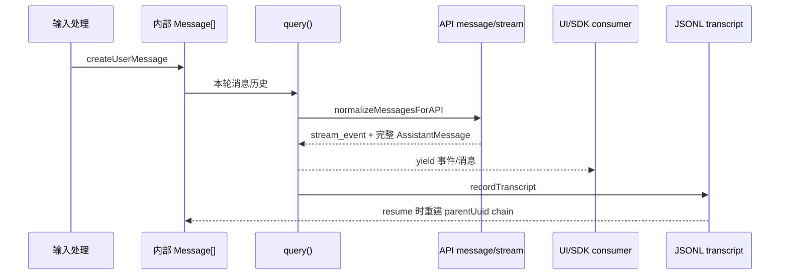

# P03 消息模型、会话持久化与恢复

> Claude Code 不是把聊天记录保存成一个数组就结束；它同时维护内部消息、API 消息、流事件、UI 状态和带父指针的 JSONL transcript。

## 学习目标

- 区分五种经常被混称为“消息”的对象；
- 理解 user/assistant/tool_use/tool_result 的配对关系；
- 看懂消息为何需要 UUID、timestamp、meta/virtual 等字段；
- 追踪消息从创建、API 规范化、流式完成到 JSONL 落盘；
- 理解恢复时为什么从 leaf 沿 `parentUuid` 回溯，而不是简单读取所有行。

## 前置知识与范围

前置：P00、P01。建议先看 P02 的事件流概念。

本课不深入压缩算法、工具执行和 API provider。压缩边界只作为消息/恢复协议解释。

阅读约定：源码块是按所列符号截取或等价压缩的短摘录；变量改名和省略字段只用于教学，完整实现以链接文件为准。

## 在整体架构中的位置



## 先建立“消息分层”词汇表

| 层次 | 典型形态 | 主要消费者 |
|---|---|---|
| 内部 `Message` | user、assistant、attachment、progress、system | query、UI、session storage |
| API message | `{role, content[]}` | Anthropic/Bedrock/Vertex/Foundry API |
| 原始流事件 | message_start、content_block_delta 等 | API 适配层、UI 临时状态 |
| SDK event | system init、assistant、result、permission denial | 外部 SDK/结构化输出 |
| UI view state | streaming text、spinner、稳定 message rows | React/Ink |
| transcript entry | JSONL + uuid + parentUuid + sessionId | 恢复、分支、回放 |

同一段文本可以依次出现在多个层次，但字段和生命周期不同。

## 先用 Python 建立最小模型

```python
from dataclasses import dataclass, field
from datetime import datetime, timezone
from typing import Literal
from uuid import uuid4

@dataclass
class UserMessage:
    type: Literal["user"] = "user"
    content: str = ""
    uuid: str = field(default_factory=lambda: str(uuid4()))
    timestamp: str = field(
        default_factory=lambda: datetime.now(timezone.utc).isoformat()
    )
    is_meta: bool = False

@dataclass
class TranscriptEntry:
    message: UserMessage
    session_id: str
    parent_uuid: str | None
```

内部消息不仅保存 API 所需的 `role/content`，还保存 UI、持久化、权限恢复和因果链需要的客户端字段。

## Claude Code 的真实实现流程

### 1. 工厂函数统一创建消息不变量

源码锚点：[utils/messages.ts: createUserMessage](../claude-code-sourcemap/restored-src/src/utils/messages.ts#L460)

```typescript
const m: UserMessage = {
  type: 'user',
  message: {
    role: 'user',
    content: content || NO_CONTENT_MESSAGE,
  },
  isMeta,
  isVirtual,
  uuid: (uuid as UUID | undefined) || randomUUID(),
  timestamp: timestamp ?? new Date().toISOString(),
  toolUseResult,
  sourceToolAssistantUUID,
  permissionMode,
  origin,
}
```

解读：

- 外层 `type` 用于客户端 discriminated union（带类型标签的联合）；
- 内层 `message.role/content` 接近 API 结构；
- 空内容会被替换，避免发送非法空消息；
- UUID 和时间戳由客户端补齐；
- `isMeta` 表示模型可见但不一定是用户手输；
- `isVirtual` 表示显示用途，API 规范化时会剔除；
- `sourceToolAssistantUUID` 把 tool_result 指回产生 tool_use 的 assistant 消息。

`createAssistantMessage`、`createSystemMessage`、`createCompactBoundaryMessage` 使用相同思想：用工厂集中维护不变量。

### 2. 一条 API message 可以被拆成多个内部消息

`normalizeMessages()` 会把一个含多个 content block 的消息拆开，并派生 UUID：

```typescript
isNewChain = isNewChain || message.message.content.length > 1
return message.message.content.map((block, index) => {
  const uuid = isNewChain
    ? deriveUUID(message.uuid, index)
    : message.uuid
  return {
    ...message,
    uuid,
    message: { ...message.message, content: [block] },
  }
})
```

为什么拆分：文本、thinking、多个并行 tool_use 在 UI、流式完成和 transcript 中可能分别到达。稳定的派生 UUID 让后续排序、去重和配对可重复。

### 3. 发 API 前不是原样序列化

源码锚点：[utils/messages.ts: normalizeMessagesForAPI](../claude-code-sourcemap/restored-src/src/utils/messages.ts#L1989)

```typescript
const availableToolNames = new Set(tools.map(t => t.name))

const reorderedMessages = reorderAttachmentsForAPI(messages).filter(
  m => !((m.type === 'user' || m.type === 'assistant') && m.isVirtual),
)
```

此函数后续还会：

- 清理不能送给 API 的系统/UI 元数据；
- 处理附件顺序；
- 删除因图片/PDF错误而需移除的 content block；
- 合并连续 user/assistant 消息以符合 API 对话结构；
- 修复或过滤未配对的 tool_use/tool_result；
- 过滤当前不可用工具的引用。

所以 transcript 中的完整历史、UI 所见历史和 API 本轮所见历史并不相等。

### 4. tool_use/tool_result 是带 ID 的协议配对

模型返回：

```text
assistant content block: { type: tool_use, id: T1, name, input }
```

客户端执行后回填：

```text
user content block: { type: tool_result, tool_use_id: T1, content }
```

这里“user role”不代表人类输入，而是 Messages API 协议规定工具结果从 user 侧回传。客户端额外保存 `sourceToolAssistantUUID`，用于 transcript 因果链和并行工具恢复。

### 5. 原始 stream event 和完整消息同时存在

源码锚点：[utils/messages.ts: handleMessageFromStream](../claude-code-sourcemap/restored-src/src/utils/messages.ts#L2930)

```typescript
if (message.type !== 'stream_event' &&
    message.type !== 'stream_request_start') {
  if (message.type === 'tombstone') {
    onTombstone?.(message.message)
    return
  }
  onStreamingText?.(() => null)
  onMessage(message)
  return
}
```

解读：

- 原始 delta 用于实时显示，不直接作为稳定 transcript 行；
- 完整消息到达时清理临时 streaming state；
- tombstone（墓碑事件）删除失败流式尝试产生的孤儿消息；
- tool-use summary 等 SDK 专用事件可以被 REPL 忽略。

### 6. transcript 是追加写的 JSONL

源码锚点：[utils/sessionStorage.ts: drainWriteQueue](../claude-code-sourcemap/restored-src/src/utils/sessionStorage.ts#L645)

```typescript
for (const { entry, resolve } of batch) {
  const line = jsonStringify(entry) + '\n'
  content += line
  resolvers.push(resolve)
}

if (content.length > 0) {
  await this.appendToFile(filePath, content)
  for (const resolve of resolvers) resolve()
}
```

写入器按文件维护队列，默认短暂缓冲后批量追加，并用 `0o600` 文件权限创建 transcript。设计收益：

- 追加写比每轮重写整段历史便宜；
- 一行一个 JSON 对象，进程异常时通常只影响尾部；
- 同一会话可以记录消息、summary、title、tag、file-history snapshot 等多种 entry；
- `flush()` 能在退出或关键边界等待所有 pending write。

### 7. `recordTranscript` 负责去重和父链

源码锚点：[utils/sessionStorage.ts: recordTranscript](../claude-code-sourcemap/restored-src/src/utils/sessionStorage.ts#L1408)

```typescript
const cleanedMessages = cleanMessagesForLogging(messages, allMessages)
const messageSet = await getSessionMessages(sessionId)
const newMessages = cleanedMessages.filter(m => !messageSet.has(m.uuid))

if (newMessages.length > 0) {
  await getProject().insertMessageChain(
    newMessages, false, undefined, startingParentUuid, teamInfo,
  )
}
```

真实代码对 compact 后的 prefix 和 chain participant 有更细处理。核心目标是：

- 同一 UUID 不重复写；
- 新消息从正确的 `parentUuid` 接续；
- progress 可以落盘，但不能成为后续对话的父节点；
- compact boundary 能切断旧历史并建立新链。

### 8. 恢复是“选 leaf，再回溯父链”

源码锚点：[utils/sessionStorage.ts: buildConversationChain](../claude-code-sourcemap/restored-src/src/utils/sessionStorage.ts#L2069)

```typescript
const transcript: TranscriptMessage[] = []
const seen = new Set<UUID>()
let currentMsg: TranscriptMessage | undefined = leafMessage

while (currentMsg) {
  if (seen.has(currentMsg.uuid)) break
  seen.add(currentMsg.uuid)
  transcript.push(currentMsg)
  currentMsg = currentMsg.parentUuid
    ? messages.get(currentMsg.parentUuid)
    : undefined
}
transcript.reverse()
```

解读：

- JSONL 是事件集合，不保证每一行都属于当前分支；
- resume 先找最新合法 leaf，再沿父指针走到 root；
- `seen` 防止损坏文件中的环造成死循环；
- 最后 reverse 得到从旧到新的对话；
- 真实函数还恢复并行 tool_use 形成的 DAG 分支，因为单父链会漏掉 sibling tool result。

## Python 对照：JSONL 父链恢复

```python
import json
from pathlib import Path

def load_chain(path: Path, leaf_uuid: str) -> list[dict]:
    entries = {}
    for line in path.read_text().splitlines():
        if not line.strip():
            continue
        item = json.loads(line)
        if "uuid" in item:
            entries[item["uuid"]] = item

    chain, seen = [], set()
    current = entries.get(leaf_uuid)
    while current is not None:
        if current["uuid"] in seen:
            raise ValueError("parentUuid cycle detected")
        seen.add(current["uuid"])
        chain.append(current)
        current = entries.get(current.get("parentUuid"))
    return list(reversed(chain))
```

这是教学简化版：未处理 compact metadata、并行工具 DAG、损坏行容错和多种 transcript entry。

## 关键状态与不变量

| 不变量 | 原因 |
|---|---|
| 每条稳定消息有 UUID | 去重、父链、工具来源、UI key |
| tool_result 必须引用 tool_use ID | API 协议配对 |
| UI-only virtual message 不进入 API | 防止展示细节污染模型上下文 |
| delta 不直接当最终 transcript 消息 | delta 是不完整临时状态 |
| 恢复要选择一个 leaf | 文件中可能存在 fork/rewind/旧分支 |
| compact boundary 改变有效历史起点 | 上下文摘要替代旧消息，但 UI/磁盘可能保留更多记录 |

## 失败路径、安全边界与设计取舍

### 进程被杀

用户消息在 API 返回前就应写入 transcript，否则“发送后立即停止”的会话无法 resume。关键场景会显式 `flushSessionStorage()`，普通路径则用批量队列降低延迟。

### 损坏或成环父链

`buildConversationChain` 用 `seen` 检测环，记录错误并返回部分 transcript，而不是无限循环。

### 并行工具形成 DAG

多个 tool_use 可共享一个 API message ID，却被拆成不同内部消息；各自 tool_result 指回不同 assistant UUID。恢复逻辑必须补回 sibling 分支，单纯 linked-list 回溯不够。

### 隐私与权限

transcript 文件以用户私有权限写入，但它仍可能包含代码、命令结果和模型回复。课程实验只能使用自建样例，不应读取或展示真实用户会话。

### 惰性序列化的引用语义

流结束的 `message_delta` 会把最终 usage/stop_reason **原地写回**已经 yield 的 message 对象。因为写入队列可能持有同一个对象引用并延迟序列化；若替换整个对象，队列可能保存旧值。这是 JavaScript 对象身份影响持久化正确性的典型例子。

## 源码锚点

| 文件/符号 | 职责 | 建议关注 |
|---|---|---|
| `src/utils/messages.ts: createUserMessage` | 内部 user 消息工厂 | UUID、meta、tool source |
| `src/utils/messages.ts: normalizeMessages` | 按 content block 拆分 | 派生 UUID、顺序 |
| `src/utils/messages.ts: normalizeMessagesForAPI` | API 投影 | 清理、合并、配对 |
| `src/utils/messages.ts: handleMessageFromStream` | UI 流事件归约 | delta、完整消息、tombstone |
| `src/utils/sessionStorage.ts: recordTranscript` | transcript 增量写入 | 去重、parent cursor |
| `src/utils/sessionStorage.ts: drainWriteQueue` | JSONL 批量追加 | flush、文件权限 |
| `src/utils/sessionStorage.ts: loadTranscriptFromFile` | 文件恢复入口 | leaf、metadata、错误 |
| `src/utils/sessionStorage.ts: buildConversationChain` | 父链重建 | 环检测、DAG 修复 |

## 动手练习

1. 用 Python 创建 root → user → assistant 三条 JSONL，再从 assistant leaf 恢复。
2. 加入一条不在当前 leaf 父链上的 fork 消息，验证它不会出现在恢复结果中。
3. 人为制造 parent cycle，给简化代码增加“返回部分链而非抛错”的策略。
4. 画出一个 assistant 同时调用两个工具时，API ID、内部 UUID、tool_use_id 和 sourceToolAssistantUUID 的关系。

## 小结与检查题

Claude Code 的消息系统可以概括为：**内部 Message 是信息最丰富的事实层，API/UI/SDK 都是不同投影；transcript 用追加事件和父指针保存可分支会话。**

自检：

1. 为什么 tool_result 在 API 中使用 user role，却不是人类消息？
2. `isVirtual` 消息为什么必须在 API 投影时剔除？
3. 为什么 JSONL 不能简单按文件顺序全部恢复？
4. message delta 为什么要原地修改最后一条完整消息？
5. 并行 tool_use 为什么让恢复结构从链表变成近似 DAG？

## 版本与证据说明

- 快照：2.1.88。
- 消息工厂、API 规范化、JSONL 写入、父链恢复：证据等级 A。
- 部分被 import 的类型定义没有作为独立 source map 文件还原；本课只依据可见工厂、消费者和运行 bundle 描述其语义。
- Context Collapse 等 feature-gated transcript entry 属于等级 B，不作为公共默认恢复流程的前提。
