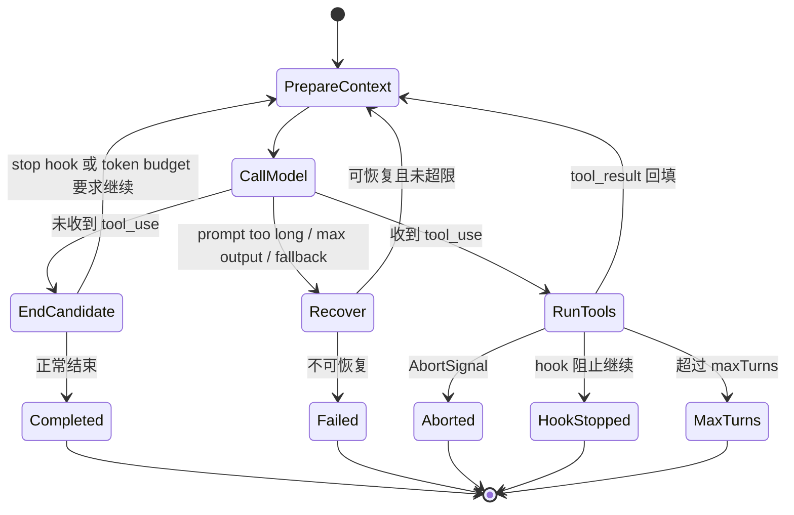

# P04 Agent 核心循环

> Claude Code 的 Agent 核心不是一次模型调用，而是一个可流式输出、可执行工具、可压缩、可恢复并有明确终止原因的异步状态机。

## 学习目标

- 理解 `query()` 的输入、输出和返回值；
- 区分一次用户 turn、一次模型 request 和一次工具 batch；
- 看懂 `State` 如何跨循环迭代保存状态；
- 追踪“模型请求工具 → 执行工具 → 回填结果 → 再问模型”的完整闭环；
- 理解停止、hook 阻断、token 恢复、fallback 和取消等路径。

## 前置知识与范围

前置：P00、P03。P01/P02 有助于理解两个上层调用者。

本课讲编排，不展开每个工具的实现、权限规则和压缩算法。它们分别属于 P06–P08。单次 API 请求如何流式解析和重试属于 P05。

阅读约定：`query.ts` 很大，代码块会明确省略日志、类型和未变化字段；流程顺序、状态字段和分支条件均来自所列源码锚点。

## 在整体架构中的位置

2.1.88 有两条主要上层路径：

```text
交互式：screens/REPL.tsx ───────────┐
                                    ├── query() → queryLoop()
headless/SDK：QueryEngine.ts ───────┘
```

二者共享核心循环，但不共享全部上层会话状态。`QueryEngine` 的源码注释也写明：它当前用于 headless/SDK，REPL 的统一仍是未来阶段。

## 先用 Python 建立最小模型

下面是可运行思路的教学简化版：

```python
from collections.abc import AsyncIterator
from dataclasses import dataclass

@dataclass
class LoopState:
    messages: list[dict]
    turn_count: int = 1

async def agent_loop(state: LoopState) -> AsyncIterator[dict]:
    while True:
        prepared = await maybe_compact(state.messages)
        requested_tools = []

        async for event in call_model(prepared):
            yield event
            if event["type"] == "tool_use":
                requested_tools.append(event)

        if not requested_tools:
            return

        tool_results = []
        async for result in run_tools(requested_tools):
            yield result
            tool_results.append(result)

        state.messages = prepared + requested_tools + tool_results
        state.turn_count += 1
```

`yield` 的价值不是语法炫技：模型 token、请求开始、工具进度、完整消息和错误都能在任务尚未结束时被 UI/SDK 消费。

真实循环还要处理 stop hooks、队列输入、fallback、最大轮数、输出上限恢复、prompt-too-long、压缩和取消。

## 三个容易混淆的计数单位

| 单位 | 含义 | 例子 |
|---|---|---|
| session | 整段可恢复会话 | 用户连续发多条消息 |
| user turn | 一次用户提交到 Agent 最终停下 | “帮我修复测试” |
| model iteration/request | 循环中的一次模型调用 | 读文件前一次，拿到结果后再一次 |

一个 user turn 可以包含多次 model request 和多个工具 batch。`queryLoop` 中的 `turnCount` 实际跟踪 agentic 迭代限制，不能只按自然语言“对话轮次”理解。

## Claude Code 的真实实现流程

### 1. `query()` 是异步生成器外壳

源码锚点：[query.ts: query](../claude-code-sourcemap/restored-src/src/query.ts#L219)

```typescript
export async function* query(
  params: QueryParams,
): AsyncGenerator<
  StreamEvent | RequestStartEvent | Message |
  TombstoneMessage | ToolUseSummaryMessage,
  Terminal
> {
  const consumedCommandUuids: string[] = []
  const terminal = yield* queryLoop(params, consumedCommandUuids)
  for (const uuid of consumedCommandUuids) {
    notifyCommandLifecycle(uuid, 'completed')
  }
  return terminal
}
```

解读：

- 生成器 `yield` 多种事件，最终 `return` 一个终止原因 `Terminal`；
- `yield*` 把内部 `queryLoop` 的事件原样转发；
- 只有正常 return 才把已消费的 queued command 标为 completed；
- 抛错或消费者主动 `.return()` 时不会伪造“成功完成”的生命周期事件。

### 2. 输入参数分为不可变配置和可变状态

`QueryParams` 包含：

- 当前消息 `messages`；
- `systemPrompt`、`userContext`、`systemContext`；
- 权限回调 `canUseTool`；
- 工具/会话上下文 `toolUseContext`；
- fallback model、maxTurns、taskBudget；
- 可注入的 `deps`，便于测试替换模型和压缩实现。

循环内部的可变状态集中在 `State`：

```typescript
type State = {
  messages: Message[]
  toolUseContext: ToolUseContext
  autoCompactTracking: AutoCompactTrackingState | undefined
  maxOutputTokensRecoveryCount: number
  hasAttemptedReactiveCompact: boolean
  maxOutputTokensOverride: number | undefined
  pendingToolUseSummary: Promise<ToolUseSummaryMessage | null> | undefined
  stopHookActive: boolean | undefined
  turnCount: number
  transition: Continue | undefined
}
```

解读：

- 这些字段必须跨一次 model request 保留；
- `transition` 记录上一次为何继续，便于测试和诊断；
- recovery counter 防止输出上限或压缩恢复无限循环；
- stop hook active 防止 hook 阻断重试失控；
- pending summary 是可与主路径并行的后台结果。

### 3. 循环采用“读取快照，整体替换”

源码锚点：[query.ts: queryLoop](../claude-code-sourcemap/restored-src/src/query.ts#L241)

```typescript
let state: State = {
  messages: params.messages,
  toolUseContext: params.toolUseContext,
  turnCount: 1,
  maxOutputTokensRecoveryCount: 0,
  hasAttemptedReactiveCompact: false,
  transition: undefined,
  // 其余字段略
}

while (true) {
  const { messages, turnCount, transition } = state
  // 完成本次迭代后：state = next; continue
}
```

源码注释把它称为 mutable cross-iteration state，但每个 continue 点会构造新的 `State` 对象，而不是散落修改九个变量。这降低了某个恢复分支忘记重置字段的概率。

Python 可用 dataclass 的 `replace` 模拟：

```python
from dataclasses import replace

state = replace(
    state,
    messages=next_messages,
    turn_count=state.turn_count + 1,
    transition="next_turn",
)
```

### 4. 每次模型调用前先投影有效上下文

循环不会把原始 `messages` 直接送给 API。主要顺序是：

1. 只取最后一个 compact boundary 后的消息；
2. 对过大的工具结果应用预算替换；
3. 可选 history snip；
4. microcompact；
5. 可选 Context Collapse 投影；
6. autocompact/full compact；
7. 拼接 system context；
8. 更新 `toolUseContext.messages`。

核心源码：

```typescript
let messagesForQuery = [
  ...getMessagesAfterCompactBoundary(messages),
]

const microcompactResult = await deps.microcompact(
  messagesForQuery, toolUseContext, querySource,
)
messagesForQuery = microcompactResult.messages

const { compactionResult } = await deps.autocompact(/* ... */)
if (compactionResult) {
  messagesForQuery = buildPostCompactMessages(compactionResult)
}
```

这说明完整 UI/transcript 历史和本轮 API 上下文是两个不同视图。P06 会解释各种压缩策略。

### 5. `deps.callModel` 只负责一次模型请求

源码锚点：[query.ts: deps.callModel 调用点](../claude-code-sourcemap/restored-src/src/query.ts#L659)

```typescript
for await (const message of deps.callModel({
  messages: prependUserContext(messagesForQuery, userContext),
  systemPrompt: fullSystemPrompt,
  thinkingConfig: toolUseContext.options.thinkingConfig,
  tools: toolUseContext.options.tools,
  signal: toolUseContext.abortController.signal,
  options: { model: currentModel, fallbackModel, querySource },
})) {
  // 收集 assistant message、tool_use，并继续向上 yield
}
```

`query/deps.ts: productionDeps()` 明确把 `callModel` 绑定到 `queryModelWithStreaming`。这种窄依赖注入使测试可以替换模型调用、microcompact、autocompact 和 UUID，而不改核心循环。

### 6. 是否继续不能只看 `stop_reason`

源码在创建 `toolUseBlocks` 附近直接注明：

```typescript
// stop_reason === 'tool_use' is unreliable --
// it's not always set correctly.
```

真实逻辑在流中看到任何 `tool_use` content block 时：

- 加入 `toolUseBlocks`；
- 设置 `needsFollowUp = true`；
- 可满足条件时开始 streaming tool execution。

因此决定权来自 **实际收到的内容块**，而不是只信响应末尾的 stop reason。

### 7. 没有工具时进入“结束候选”路径

当 `needsFollowUp` 为 false，循环并不立即 return。它依次处理：

- prompt-too-long/media error 的 reactive compact 恢复；
- `max_output_tokens` 升级或续写恢复；
- API error 终止；
- Stop hooks；
- 可选 token budget 自动继续；
- 最后才 `return { reason: 'completed' }`。

输出上限恢复的状态转移如下。为突出变化，下面是按真实分支压缩后的等价摘录，并非逐字复制全部 `State` 字段：

```typescript
if (maxOutputTokensRecoveryCount < MAX_OUTPUT_TOKENS_RECOVERY_LIMIT) {
  const recoveryMessage = createUserMessage({
    content: 'Output token limit hit. Resume directly ...',
    isMeta: true,
  })
  state = {
    ...state,
    messages: [...messagesForQuery, ...assistantMessages, recoveryMessage],
    maxOutputTokensRecoveryCount: maxOutputTokensRecoveryCount + 1,
    transition: { reason: 'max_output_tokens_recovery', attempt: 1 },
  }
  continue
}
```

这条 meta message 对模型可见、对用户输入语义隐藏，用来要求从截断点继续。恢复次数有上限，避免无限续写。

### 8. 有工具时执行工具 batch

源码锚点：[query.ts: toolUpdates](../claude-code-sourcemap/restored-src/src/query.ts#L1379)

```typescript
const toolUpdates = streamingToolExecutor
  ? streamingToolExecutor.getRemainingResults()
  : runTools(
      toolUseBlocks,
      assistantMessages,
      canUseTool,
      toolUseContext,
    )

for await (const update of toolUpdates) {
  if (update.message) {
    yield update.message
    toolResults.push(/* API-normalized user tool_result */)
  }
  if (update.newContext) updatedToolUseContext = update.newContext
}
```

解读：

- 工具执行本身也是 AsyncGenerator，会产生 progress、attachment、tool_result；
- `streamingToolExecutor` 可在工具输入流式完成时提前启动安全工具；否则批量调用 `runTools`；
- `canUseTool` 是权限决策注入点，不在 query 中硬编码 UI；
- 工具可以返回新的 context，例如更新文件读取缓存；
- 回填给 API 的工具结果会先经过 `normalizeMessagesForAPI`。

并非所有工具都并行。是否并行由 `services/tools` 的调度和工具属性决定，不能从 `runTools` 这个复数名字推断。

### 9. 工具完成后构造下一次迭代

```typescript
const next: State = {
  messages: [
    ...messagesForQuery,
    ...assistantMessages,
    ...toolResults,
  ],
  toolUseContext: toolUseContextWithQueryTracking,
  turnCount: nextTurnCount,
  transition: { reason: 'next_turn' },
  // 重置本次 request 的恢复字段
}
state = next
```

消息顺序必须是：旧上下文 → assistant tool_use → user tool_result。源码特意在工具结束后才插入普通排队输入，因为 API 不允许把普通 user message 插入 tool_use/tool_result 配对之间。

### 10. 上层如何消费循环

交互式 REPL：

```typescript
for await (const event of query(params)) {
  onQueryEvent(event)
}
```

headless/SDK 的 `QueryEngine.submitMessage()`：

```typescript
for await (const message of query({
  ...params,
  querySource: 'sdk',
})) {
  // 累计 usage、写 transcript、转换为 SDKMessage
}
```

`QueryEngine` 还持有跨用户提交的 `mutableMessages`、permission denials、usage、read-file cache 和 AbortController。

## 完整状态转换图



## 失败路径、安全边界与设计取舍

### 用户取消

模型请求和工具执行共享 `toolUseContext.abortController.signal`。工具中途取消后，循环可以 yield interruption message，并返回 `{ reason: 'aborted_tools' }`。`QueryEngine.interrupt()` 只是调用 `this.abortController.abort()`，真正的取消响应分散在 API 和工具层。

### streaming fallback 的墓碑

一次流式尝试已经 yield 了部分 thinking/assistant 消息，随后切到非流式 fallback 时，这些消息的签名和 tool_use ID 不能再使用。query 会 yield tombstone 删除孤儿消息、清空已收集工具块，并重新建立 streaming executor。

### API error 不运行 stop hook

模型没有产生有效回答时运行 stop hook，可能形成“API error → hook 阻断 → 重试 → API error”的死循环。源码对此直接 early return，并记录 stop failure hook。

### maxTurns

最大轮数在下一轮之前检查；达到上限会先 yield `max_turns_reached` attachment，再返回明确终止原因。它限制的是 agentic 继续次数，不是 API SDK 自带的网络重试次数。

### 状态重置

每个 continue 点都要决定哪些字段继承、哪些重置。例如 reactive compact guard 在 stop-hook 重试中必须保留，否则可能反复压缩并消耗大量 API 调用。

## 源码锚点

| 文件/符号 | 职责 | 建议关注 |
|---|---|---|
| `src/query.ts: query` | 对外事件生成器 | 正常完成通知、返回 Terminal |
| `src/query.ts: queryLoop` | Agent 状态机 | State、while、continue/return |
| `src/query/config.ts: buildQueryConfig` | 本轮配置快照 | 避免循环中漂移 |
| `src/query/deps.ts: productionDeps` | 窄依赖注入 | callModel、compact、uuid |
| `src/query/stopHooks.ts: handleStopHooks` | 结束前 hook | 阻断与防递归 |
| `src/services/tools/toolOrchestration.ts: runTools` | 工具 batch 编排 | 并行、更新、取消 |
| `src/QueryEngine.ts: QueryEngine.submitMessage` | SDK/headless 会话包装 | transcript、usage、SDK event |
| `src/screens/REPL.tsx: query 调用点` | 交互调用者 | 事件归约到 UI |

## 动手练习

1. 扩展 Python 简化循环，增加 `max_turns=3` 和 Abort Event。
2. 构造模型事件序列：text → tool_use → tool_result → text，画出每次 state.messages。
3. 解释为何不能只用最后的 `stop_reason` 判断是否执行工具。
4. 找出源码中至少三种 `transition.reason`，说明每种继续时哪些状态应重置。
5. 为假模型实现一个 `deps.callModel`，验证核心循环无需真实 API 也能测试。

## 小结与检查题

Claude Code 的核心循环可以概括为：**先投影上下文，流式调用模型，以实际 content block 决定工具跟进，执行并回填结果，再通过显式状态转移继续或返回终止原因。**

自检：

1. 一次 user turn 为什么可能包含多次 model request？
2. `State.transition` 对测试和诊断有什么价值？
3. 没有 tool_use 时为什么不能立刻 return？
4. 工具结果插入消息历史时，顺序必须满足什么协议？
5. REPL 和 QueryEngine 在哪一层汇合，哪一层仍不同？

## 版本与证据说明

- 快照：2.1.88。
- REPL/QueryEngine 两条调用路径、State、tool_use 跟进、工具回填、取消和 maxTurns：证据等级 A。
- Context Collapse、token budget 等构建期开关分支：证据等级 B。
- `query.ts` import 的部分 transition 类型未作为独立 source map 文件落盘；本课终止/继续语义依据实际 return、state 写入和调用方验证。
