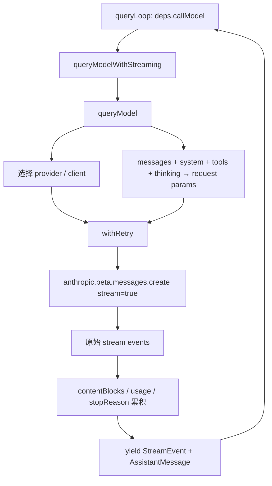

# P05 模型 API、流式协议与重试

> P04 的 `callModel()` 在本课落地为一条完整网络管线：选择 provider、构造请求、读取原始流事件、累积内容与 usage、处理取消，并在不同层次进行重试或 fallback。

## 学习目标

- 理解 `query.ts` 如何连接 `queryModelWithStreaming()`；
- 看懂 API 请求由哪些核心部分组成；
- 理解 message/content block 流事件如何组合成完整消息；
- 区分网络重试、流式转非流式 fallback 和模型 fallback；
- 区分上下文窗口、`max_tokens`、task budget、maxTurns 和费用预算。

## 前置知识与范围

前置：P03、P04。

本课研究客户端 API 适配层，不讲模型内部推理。Prompt 内容如何组装属于 P06，provider 的完整认证细节属于 P13。

阅读约定：API 源文件超过三千行，源码块会省略泛型、遥测和 provider 特例；请求字段、事件顺序与错误分层均可在源码锚点逐项核验。

## 在整体架构中的位置



## 先用 Python 建立最小模型

```python
from collections.abc import AsyncIterator

async def call_model(request: dict) -> AsyncIterator[dict]:
    blocks: dict[int, dict] = {}

    async for event in open_stream_with_retry(request):
        if event["type"] == "content_block_start":
            blocks[event["index"]] = event["content_block"]
        elif event["type"] == "content_block_delta":
            apply_delta(blocks[event["index"]], event["delta"])
        elif event["type"] == "content_block_stop":
            yield {
                "type": "assistant_message",
                "content": [blocks[event["index"]]],
            }
        yield {"type": "raw_stream_event", "event": event}
```

教学重点：raw event 用于实时反馈，完整 block 用于稳定消息。真实实现还维护 thinking 签名、tool input JSON、usage、成本、request ID、缓存、provider 差异和 fallback。

## Claude Code 的真实实现流程

### 1. 依赖注入把 Agent 循环与 API 层隔开

源码锚点：[query/deps.ts: productionDeps](../claude-code-sourcemap/restored-src/src/query/deps.ts#L29)

```typescript
export function productionDeps(): QueryDeps {
  return {
    callModel: queryModelWithStreaming,
    microcompact: microcompactMessages,
    autocompact: autoCompactIfNeeded,
    uuid: randomUUID,
  }
}
```

解读：

- P04 只依赖 `callModel` 的异步事件契约；
- 生产环境绑定真实 API，测试可以注入 fake generator；
- API 层不决定 Agent 是否继续，它只完成一次请求并报告事件/消息。

### 2. 流式与非流式入口共享 `queryModel`

源码锚点：[services/api/claude.ts: queryModelWithStreaming](../claude-code-sourcemap/restored-src/src/services/api/claude.ts#L752)。下面省略了解构参数类型：

```typescript
export async function* queryModelWithStreaming(args) {
  return yield* withStreamingVCR(args.messages, async function* () {
    yield* queryModel(
      args.messages,
      args.systemPrompt,
      args.thinkingConfig,
      args.tools,
      args.signal,
      args.options,
    )
  })
}
```

`queryModelWithoutStreaming()` 也消费同一个 generator，只保留最后的 assistant message，并继续把生成器耗尽，确保请求成功统计在最后执行。

`withStreamingVCR` 是记录/回放边界；核心请求仍在私有 `queryModel()`。

### 3. provider 由环境显式选择

源码锚点：[utils/model/providers.ts: getAPIProvider](../claude-code-sourcemap/restored-src/src/utils/model/providers.ts#L6)

```typescript
return isEnvTruthy(process.env.CLAUDE_CODE_USE_BEDROCK)
  ? 'bedrock'
  : isEnvTruthy(process.env.CLAUDE_CODE_USE_VERTEX)
    ? 'vertex'
    : isEnvTruthy(process.env.CLAUDE_CODE_USE_FOUNDRY)
      ? 'foundry'
      : 'firstParty'
```

支持的客户端 provider 类型是：

- `firstParty`：Anthropic API；
- `bedrock`：AWS Bedrock；
- `vertex`：Google Vertex AI；
- `foundry`：Azure AI Foundry 路径。

provider 会影响 client、认证、模型名、beta header、缓存能力和错误判断。不能把 first-party 的默认行为无条件套到其他 provider。

### 4. 请求参数是多层上下文的投影

`queryModel()` 内部的 `paramsFromContext()` 最终返回近似结构：

```typescript
return {
  model: normalizeModelStringForAPI(options.model),
  messages: addCacheBreakpoints(messagesForAPI, /* ... */),
  system,
  tools: allTools,
  tool_choice: options.toolChoice,
  metadata: getAPIMetadata(),
  max_tokens: maxOutputTokens,
  thinking,
  ...(outputConfig && { output_config: outputConfig }),
}
```

解读：

- `messagesForAPI` 已由 P03 的规范化流程清洗；
- system prompt 单独作为 system blocks；
- 工具转换为 API schema，不传客户端执行函数；
- thinking、effort、task budget 进入不同请求字段；
- prompt cache breakpoint 会修改消息/system block 的 cache control；
- model string 需要按 provider 规范化。

这里描述的是“模型能看到什么的传输格式”。内容的来源和优先级在 P06 讲。

### 5. SDK 自动重试被关闭，客户端自己控制

源码锚点：[services/api/claude.ts: queryModel 请求点](../claude-code-sourcemap/restored-src/src/services/api/claude.ts#L1778)

```typescript
const generator = withRetry(
  () => getAnthropicClient({
    maxRetries: 0,
    model: options.model,
    fetchOverride: options.fetchOverride,
    source: options.querySource,
  }),
  async anthropic => {
    const params = paramsFromContext(/* ... */)
    const result = await anthropic.beta.messages
      .create(
        { ...params, stream: true },
        { signal },
      )
      .withResponse()
    return result.data
  },
  retryOptions,
)
```

解读：

- SDK 的 `maxRetries` 设为 0，防止 SDK 和 Claude Code 两套重试叠加；
- 自研 `withRetry` 可以 yield “正在重试”的 system event；
- `withResponse()` 同时获得 stream、HTTP response 和 request ID；
- 同一个 AbortSignal 传到网络请求；
- request dispatch 前后打 checkpoint，用于区分客户端准备、网络 TTFB 和首 token 延迟。

### 6. 为什么使用 raw stream

源码注释明确说明不使用 SDK 的 `BetaMessageStream`：它会在每个 `input_json_delta` 上反复 partial JSON parse，复杂工具输入可能造成近似 O(n²) 工作。Claude Code 选择 raw stream，自己累积工具 JSON 字符串。

这体现一个工程原则：高层 SDK 方便，但 Agent 的长工具参数和实时 UI 可能需要更低层事件控制。

### 7. 流事件如何变成完整 content block

源码锚点：[services/api/claude.ts: stream loop](../claude-code-sourcemap/restored-src/src/services/api/claude.ts#L1940)

核心事件序列：

| 事件 | 客户端动作 |
|---|---|
| `message_start` | 保存 message envelope、初始 usage、计算 TTFT |
| `content_block_start` | 按 index 初始化 text/thinking/tool_use 容器 |
| `content_block_delta` | 向对应 block 累加文本、thinking、签名或工具 JSON |
| `content_block_stop` | 规范化该 block，创建并 yield 完整 AssistantMessage |
| `message_delta` | 更新累计 usage、最终 stop_reason 和费用 |
| `message_stop` | 结束协议消息，无额外内容 |

关键源码：

```typescript
case 'content_block_stop': {
  const contentBlock = contentBlocks[part.index]
  const m: AssistantMessage = {
    message: {
      ...partialMessage,
      content: normalizeContentFromAPI([contentBlock], tools),
    },
    requestId: streamRequestId,
    type: 'assistant',
    uuid: randomUUID(),
    timestamp: new Date().toISOString(),
  }
  newMessages.push(m)
  yield m
}
```

一个 API message 含多个 block 时，会 yield 多个内部 AssistantMessage。这与 P03 的 UUID 派生和并行工具恢复相呼应。

### 8. 为什么 usage 和 stop reason 要原地回写

`content_block_stop` 通常早于 `message_delta`。完整内部消息已经 yield 并可能进入延迟 transcript 写队列，但最终 usage/stop reason 还没到。

```typescript
case 'message_delta': {
  usage = updateUsage(usage, part.usage)
  stopReason = part.delta.stop_reason
  const lastMsg = newMessages.at(-1)
  if (lastMsg) {
    lastMsg.message.usage = usage
    lastMsg.message.stop_reason = stopReason
  }
}
```

直接 mutation 保持对象身份，使 UI、query 收集数组和延迟写队列看到同一份最终值。若用 `{...old, usage}` 替换对象，早先持有的引用仍会序列化旧 usage。

### 9. usage 是累计值，不是每个 delta 的增量

源码锚点：[services/api/claude.ts: updateUsage](../claude-code-sourcemap/restored-src/src/services/api/claude.ts#L2924)

Anthropic 流事件中的 usage 通常表示“截至当前的累计总量”。因此 `updateUsage`：

- input/cache token 只有非零新值才覆盖，避免 message_delta 的 0 抹掉 message_start 真值；
- output token 使用最新累计值；
- server tool use、cache creation、iterations、speed 等字段分别合并；
- 跨多次 assistant request 的 session 总量才用 `accumulateUsage` 做加法。

把同一次 stream 的累计 usage 每次相加会严重重复计费。

## 三层重试与 fallback

### 第一层：请求级 retry

源码锚点：[services/api/withRetry.ts: withRetry](../claude-code-sourcemap/restored-src/src/services/api/withRetry.ts#L170)

```typescript
for (let attempt = 1; attempt <= maxRetries + 1; attempt++) {
  if (options.signal?.aborted) throw new APIUserAbortError()
  try {
    client ??= await getClient()
    return await operation(client, attempt, retryContext)
  } catch (error) {
    // 分类、计算 delay、yield retry event、可取消 sleep
  }
}
```

认证错误、stale keep-alive、rate limit、overload 等错误有不同处理；部分错误会重建 client。等待期间也检查 AbortSignal。

### 第二层：流式转非流式 fallback

HTTP headers 已成功但 stream 中途损坏、长时间 idle 或没有形成完整 block 时，客户端可以：

1. 清理/中止原 stream；
2. 通知上层清除已 yield 的孤儿消息；
3. 使用同一请求参数发起有超时上限的非流式 `messages.create`；
4. 把最终 message 转成相同内部格式。

这是 **传输模式 fallback**，模型可以不变。

### 第三层：模型 fallback

连续特定 overload（例如 529）达到阈值且配置了 fallback model 时，`withRetry` 抛出：

```typescript
throw new FallbackTriggeredError(
  options.model,
  options.fallbackModel,
)
```

这个特殊错误必须传播回 `query.ts`，由 Agent 层切换模型并重新进行请求。它不是普通 assistant error message。

三者对比：

| 机制 | 改变什么 | 谁主导 |
|---|---|---|
| 请求 retry | 重新请求，模型/传输通常不变 | `withRetry` |
| streaming → non-streaming | 传输方式改变，模型通常不变 | `queryModel` fallback |
| model fallback | 模型改变，Agent request 重启 | `query.ts` + `FallbackTriggeredError` |

## 五种限制不要混淆

| 限制 | 约束对象 | 主要处理位置 |
|---|---|---|
| context window | 输入历史 + 输出可用空间 | query 压缩、API error；P06详讲 |
| `max_tokens` | 单次请求最大输出 | `claude.ts` 请求参数与 `query.ts` 恢复 |
| API task budget | 整个 agentic turn 的服务端输出预算 | `output_config.task_budget`，跨压缩更新 remaining |
| `maxTurns` | Agent 工具循环迭代数 | `query.ts` |
| `maxBudgetUsd` | 客户端费用上限 | QueryEngine/print 会话层 |

此外还有 feature-gated token budget 自动续写，它不同于 API task budget。课程或代码审查中必须写完整名称。

## Python 对照：可取消指数退避

```python
import asyncio
import random

async def retry(operation, *, attempts: int, cancel: asyncio.Event):
    last_error = None
    for attempt in range(1, attempts + 1):
        if cancel.is_set():
            raise asyncio.CancelledError
        try:
            return await operation()
        except RetryableError as exc:
            last_error = exc
            delay = min(0.5 * 2 ** (attempt - 1), 30.0)
            delay *= random.uniform(0.8, 1.2)
            try:
                await asyncio.wait_for(cancel.wait(), timeout=delay)
                raise asyncio.CancelledError
            except asyncio.TimeoutError:
                pass
    raise last_error
```

这是教学简化版。真实实现会尊重 `Retry-After`、区分 provider/状态码、生成 retry system event、刷新认证 client，并支持持续重试心跳。

## 失败路径、安全边界与设计取舍

### 用户取消不是 API 错误消息

`queryModelWithoutStreaming` 在没有 assistant message 且 signal 已 aborted 时抛 `APIUserAbortError`。`queryModel` 的 catch 也避免为用户主动取消 yield 一条“API 失败”的 assistant message，否则 UI 会把正常取消显示成故障。

### 无首事件或无完整 block

连接成功不等于响应有效。stream 结束但没有 `message_start` 或没有完成任何 content block 时，会触发非流式 fallback 或错误，而不是返回空成功。

### stream idle watchdog

流建立后长时间没有事件时，客户端需要中止挂起 stream 并决定 fallback。普通网络 timeout 和“headers 已到、stream 卡死”是两个阶段。

### 清理资源

`cleanupStream()` 检查 stream controller，未中止则 abort。正常结束、错误、取消和消费者提前停止都必须释放 watchdog timer、listener 和 stream 资源。

### 捕获请求时的敏感信息

源码会捕获请求用于 bug report/诊断，但课程不得展示真实 prompt、token、认证 header 或用户代码。可观测性应记录标量和无 PII 元数据。

## 源码锚点

| 文件/符号 | 职责 | 建议关注 |
|---|---|---|
| `src/query/deps.ts: productionDeps` | Agent/API 接缝 | 可测试依赖注入 |
| `src/services/api/claude.ts: queryModelWithStreaming` | 流式公共入口 | VCR 包装、generator 契约 |
| `src/services/api/claude.ts: queryModel` | 请求与流解析核心 | params、stream、fallback |
| `src/services/api/claude.ts: executeNonStreamingRequest` | 非流式 fallback | timeout、同构结果 |
| `src/services/api/claude.ts: updateUsage` | 单 stream usage 合并 | 累计值、0 覆盖保护 |
| `src/services/api/claude.ts: cleanupStream` | 资源释放 | abort controller |
| `src/services/api/withRetry.ts: withRetry` | 请求重试 | 分类、backoff、取消、心跳 |
| `src/utils/model/providers.ts: getAPIProvider` | provider 选择 | 环境优先级 |
| `src/utils/model/model.ts` | 模型名解析与能力 | provider 规范化 |

## 动手练习

1. 写一个 fake raw stream，依次发出 message_start、text start、两个 delta、block stop、message delta，并组装最终消息。
2. 修改 fake stream，在 delta 前缺失 block start，确认适配器应报协议错误而不是静默创建 block。
3. 为 Python retry 增加 `Retry-After`，并保证 cancel 在等待中立即生效。
4. 分别举例说明请求 retry、传输 fallback 和模型 fallback，画出它们回到哪一层。
5. 给出一个场景，解释为什么 `maxTurns=3` 和 `max_tokens=8000` 不能互相替代。

## 小结与检查题

Claude Code 的 API 层可以概括为：**把内部上下文投影为 provider 请求，用 raw stream 自己累积 content block，以同一事件契约向上输出，并把请求重试、传输 fallback、模型 fallback 分层处理。**

自检：

1. 为什么生产 SDK client 的自动 retry 被设置为 0？
2. `content_block_stop` 和 `message_delta` 分别完成什么信息？
3. 同一 stream 的 usage 为什么不能每次 delta 都做加法？
4. streaming fallback 与 model fallback 有何区别？
5. AbortSignal 必须传到哪几个阶段才算真正可取消？

## 版本与证据说明

- 快照：2.1.88。
- provider 选择、请求参数、raw stream、usage 回写、手工 retry、非流式 fallback：证据等级 A。
- advisor、cache editing、部分 persistent retry 和其他 feature-gated beta：证据等级 B。
- provider 的服务端行为、模型内部 thinking 和 API 后端调度不在客户端快照中；本课不作推断。
