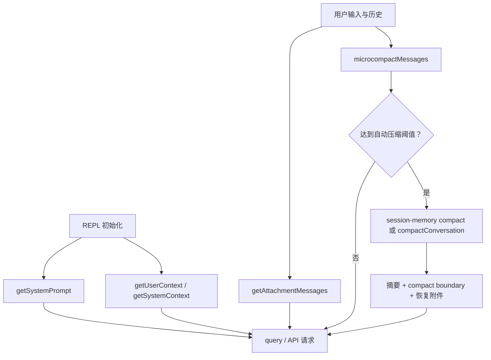

# P06 上下文、Prompt、记忆与压缩

> Claude Code 每轮发送的不是“聊天记录原样复制”，而是由稳定 system prompt、动态环境、用户上下文、附件与历史消息共同构成的上下文；空间不足时，它先清理可丢弃内容，再用摘要边界替换旧历史。

## 学习目标

- 区分上下文窗口、输出 token 上限与费用预算；
- 区分 system prompt、system context、user context、附件和 CLAUDE.md；
- 追踪 CLAUDE.md 从发现、解析到注入消息的路径；
- 比较 microcompact、auto/full compact 与 session memory；
- 理解压缩的失败、取消、重试和压缩后恢复动作。

## 前置知识与范围

前置：P03、P04、P05。

本课讲客户端怎样组织模型输入和管理上下文，不公开或大段复制产品 prompt。工具执行、权限和 Skill 的完整机制分别属于 P07、P08、P10。`SessionMemory`、`EXTRACT_MEMORIES`、`CACHED_MICROCOMPACT` 等路径受构建特性或运行配置影响；看到源码不等于外部公共构建一定启用。

## 在整体架构中的位置



状态所有者不是单一模块：REPL 保存会话级 prompt/context，`query()` 保存本轮消息与读取文件状态，压缩服务返回一组替换消息，session storage 继续保留可恢复 transcript。

## 先用 Python 建立最小模型

下面是教学简化版，可独立理解，但不等价于真实的缓存 API、React 状态或 Bun 构建特性：

```python
from dataclasses import dataclass

@dataclass
class ContextBundle:
    system_prompt: str
    user_context: str
    system_context: str
    messages: list[dict]

def prepare_context(bundle: ContextBundle, token_limit: int) -> ContextBundle:
    messages = clear_old_tool_results(bundle.messages)
    if estimate_tokens(messages) <= token_limit:
        return ContextBundle(
            bundle.system_prompt,
            bundle.user_context,
            bundle.system_context,
            messages,
        )

    summary = summarize_old_history(messages)
    boundary = {"type": "compact_boundary", "summary": summary}
    recent = keep_recent_complete_api_rounds(messages)
    return ContextBundle(
        bundle.system_prompt,
        bundle.user_context,
        bundle.system_context,
        [boundary, *recent],
    )
```

这里有两个关键约束：摘要不是永久记忆的同义词；保留“完整 API round”是为了不拆散 `tool_use` 与 `tool_result`。

## Claude Code 的真实实现流程

### 1. 首次组装分成三个并行来源

交互式入口在 `REPL.tsx` 中并行取得 `getSystemPrompt()`、`getUserContext()` 和 `getSystemContext()`。这三个名字容易混淆：

| 来源 | 主要内容 | 变化频率 |
|---|---|---|
| system prompt | 工具使用、行为与会话规则；会根据模型和可用工具拼装 | 工具集、模型或模式变化时 |
| system context | 运行环境和仓库状态等系统侧信息 | 环境变化时 |
| user context | 用户/项目指令文件等用户可控上下文 | 指令文件变化时 |
| attachment | 当前输入、IDE 选择、文件引用、提醒、Hook/MCP/记忆增量 | 每轮甚至每次工具迭代 |

`getSystemPrompt()` 以小节函数组合内容，并接收启用工具、模型、额外工作目录和 MCP 客户端。`computeEnvInfo()` 再计算动态环境信息。课程应把它理解成“结构化组装器”，而不是一条永远不变的字符串。

### 2. CLAUDE.md 是带来源和加载策略的指令文件

`getMemoryFiles()` 负责发现多类 instruction memory；`processMemoryFile()` 读取文件、解析 include，并限制递归深度；`getClaudeMds()` 再产出可注入内容。重要边界包括：

- 文件可能来自 managed、user、project、local 等不同层次；
- Markdown include 需要解析与路径处理，不是无条件字符串拼接；
- HTML 注释会被剥离；过大的文件会被识别并限制；
- 外部 include 有单独警告路径；
- 缓存可以由 `clearMemoryFileCaches()` / `resetGetMemoryFilesCache()` 清理。

`memoryFilesToAttachments()` 把文件信息转换为内部 attachment，之后 `createAttachmentMessage()` 才把它变成模型可见消息。因而“指令文件”“附件对象”“API user message”是三个层次。

### 3. 附件是在工具轮次边界动态补充的

`query.ts` 在工具执行完成之后调用 `getAttachmentMessages()`，把队列通知、文件变化、计划模式、Hook 输出等加入 `toolResults`。源码特意把这一步放在工具调用结束之后，以免普通 user message 插进 `tool_use/tool_result` 配对之间导致 API 拒绝。

相关记忆预取采用零等待策略：如果异步预取已经完成且尚未消费，就过滤重复内容后注入；尚未完成则跳过，在下一次 agent iteration 再尝试。这避免让主循环为了可选记忆阻塞。

### 4. microcompact 先处理“可丢弃的重量”

`microcompactMessages()` 当前有两条可见策略：

1. 时间型路径：当主线程距离上次 assistant message 足够久、服务端缓存很可能已冷却时，把较老的可压缩工具结果替换为清理标记，同时至少保留最近一个；
2. `CACHED_MICROCOMPACT` 路径：为支持的主线程与模型登记工具结果，在 API 层提交 cache edits，本地 messages 可以保持不变。

如果特性不可用、模型不支持或运行在子 Agent，函数可以原样返回 messages，后续由 autocompact 处理压力。不能把 microcompact 描述为每轮必然重写 transcript。

### 5. autocompact 决定是否跨越摘要边界

`shouldAutoCompact()` 根据估算 token、模型有效窗口和阈值判断。`autoCompactIfNeeded()` 还包含两个保护：

- `DISABLE_COMPACT` 可关闭自动压缩；
- 连续失败达到上限后触发 circuit breaker，避免每轮重复调用注定失败的摘要请求。

命中阈值后，它会先尝试 `trySessionMemoryCompaction()`；若不适用，再调用 `compactConversation()`。这表明 session-memory compact 是实验性优先路径，不是与 full compact 无关的另一套会话引擎。

### 6. full compact 是一次受约束的模型摘要事务

`compactConversation()` 的正常路径是：

1. 拒绝空消息；记录压缩前 token；
2. 运行 `PreCompact` hooks，并合并额外指令；
3. 构造仅用于摘要的请求，流式取得 summary；
4. 若摘要请求本身 prompt-too-long，按完整 API round 从头截断并有限重试；
5. 验证摘要不为空且不是 API error；
6. 清理旧的 read-file / nested-memory 状态；
7. 恢复少量关键文件、计划、已调用 Skill、动态工具/MCP 指令等附件；
8. 创建 compact boundary 和 summary messages；
9. 运行压缩后清理与相关 hooks。

摘要边界既告诉模型“前史已被概括”，也让 transcript/恢复逻辑知道历史发生过语义替换。压缩不是简单删除数组前半段。

## 关键数据结构与状态变化

| 状态 | 压缩前 | 压缩后 |
|---|---|---|
| messages | 完整历史、工具结果、附件 | compact boundary、摘要、保留段、恢复附件 |
| readFileState | 记录已经读取的文件 | 先快照后清空，再有限恢复关键文件 |
| loadedNestedMemoryPaths | 已加载的嵌套指令 | 清空，避免沿用失效加载状态 |
| session-memory cursor | 指向上次总结消息 | legacy/full compact 后重置 |
| tool schema/MCP instruction delta | 依赖旧消息中的公告 | 压缩后重新公告当前集合 |

四个“预算”不能混用：

| 概念 | 约束什么 |
|---|---|
| context window | 本次请求可容纳的输入与生成空间 |
| output token limit | 单次模型响应最多生成多少 |
| maxTurns | Agent 循环最多迭代多少次 |
| maxBudgetUsd | 会话/任务费用边界 |

## 源码锚点

| 文件/符号 | 在流程中的职责 | 建议关注 |
|---|---|---|
| [`src/screens/REPL.tsx: getSystemPrompt 调用`](../claude-code-sourcemap/restored-src/src/screens/REPL.tsx) | 初始化三类上下文 | 并行获取与刷新时点 |
| [`src/constants/prompts.ts: getSystemPrompt`](../claude-code-sourcemap/restored-src/src/constants/prompts.ts) | system prompt 组装 | 动态小节、工具/模型差异 |
| [`src/context.ts: getSystemContext/getUserContext`](../claude-code-sourcemap/restored-src/src/context.ts) | 环境与用户上下文 | memoize 与信息边界 |
| [`src/utils/claudemd.ts: getMemoryFiles/processMemoryFile`](../claude-code-sourcemap/restored-src/src/utils/claudemd.ts) | 指令文件发现与解析 | include、来源、限制、缓存 |
| [`src/utils/attachments.ts: getAttachments/getAttachmentMessages`](../claude-code-sourcemap/restored-src/src/utils/attachments.ts) | 动态上下文转消息 | 轮次注入与去重 |
| [`src/services/compact/microCompact.ts: microcompactMessages`](../claude-code-sourcemap/restored-src/src/services/compact/microCompact.ts) | 工具结果轻量清理 | 时间型与 cache-edit 路径 |
| [`src/services/compact/autoCompact.ts: autoCompactIfNeeded`](../claude-code-sourcemap/restored-src/src/services/compact/autoCompact.ts) | 阈值与降级选择 | 开关、失败熔断 |
| [`src/services/compact/compact.ts: compactConversation`](../claude-code-sourcemap/restored-src/src/services/compact/compact.ts) | full compact 事务 | 重试、边界、恢复附件 |
| [`src/services/SessionMemory/sessionMemory.ts: shouldExtractMemory`](../claude-code-sourcemap/restored-src/src/services/SessionMemory/sessionMemory.ts) | 会话记忆抽取 | 特性门控与游标 |

## 失败路径、安全边界与设计取舍

- 取消：摘要请求通过 `AbortController` 传播取消；用户取消与不完整响应有独立错误语义。
- prompt-too-long：不是无限重试，而是按 API round 截去最旧部分并设置重试上限。
- 摘要无正文/API error：事务失败，不应把空摘要当成成功边界。
- 指令信任：CLAUDE.md 和外部 include 是用户/项目可控输入，不是服务端真理；来源和路径警告属于信任边界。
- 信息损失：full compact 必然有损，因此代码显式恢复文件、计划、Skill 和动态工具信息。
- 缓存与语义：cached microcompact 优先减少缓存重写成本；full compact 优先恢复可继续工作的语义状态。

## 动手练习

1. 给 Python 模型补上 `tool_use_id` 配对检查，保证截断不留下孤立结果。
2. 在 `query.ts` 中定位 `getAttachmentMessages()`，说明为何它位于工具完成之后。
3. 比较 `microcompactMessages()` 返回本地 messages 不变与直接替换旧结果的两条路径。
4. 画出一次 prompt-too-long 压缩重试，标出被截断的是消息还是 API round。

## 小结与检查题

本课的心智模型是“分层组装、按轮注入、先轻量清理、再摘要换代”。

1. system prompt、user context 和 attachment 为什么不能合并成同一概念？
2. 为什么附件不能插到 `tool_use` 与 `tool_result` 之间？
3. cached microcompact 为什么可能不修改本地 messages？
4. full compact 后为什么要恢复文件与动态工具信息？
5. session memory 源码存在时，为什么仍不能断言公共构建必然启用？

## 版本与证据说明

- 快照版本：`@anthropic-ai/claude-code` 2.1.88。
- A 级：三类上下文组装、附件在 query 循环中的注入、legacy/full compact 正常与失败路径均可由自有源码和公共 bundle 对照。
- B 级：`CACHED_MICROCOMPACT`、`SessionMemory`、`EXTRACT_MEMORIES` 等受 feature/build/runtime 配置控制；课程只确认源码机制，不确认所有用户均启用。
- 本课没有把客户端 prompt 编排描述为模型内部或 Anthropic 服务端实现。
