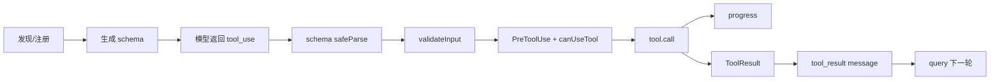

# P07 工具抽象与执行流水线

> Claude Code 的工具不是一个可调用函数列表，而是一套从注册、schema、双层校验、权限、执行、进度到 `tool_result` 回填的统一协议。

## 学习目标

- 理解 `Tool` 契约怎样统一内置工具与 MCP 工具；
- 追踪一次 `tool_use` 从模型输出到结果回填；
- 区分 schema 校验、工具业务校验与权限决策；
- 理解串行/并发分组的真实条件；
- 看懂取消、未知工具、过大结果和 Hook 失败路径。

## 前置知识与范围

前置：P04、P05。P03 的消息配对概念也很重要。

本课聚焦工具执行契约。具体权限优先级、危险命令和 sandbox 属于 P08；MCP 工具怎样发现属于 P10；子 Agent 属于 P11。

## 在整体架构中的位置



这条顺序是本区固定心智模型：发现/注册 → schema → 输入校验 → 权限 → 执行 → 进度 → 结果。

## 先用 Python 建立最小模型

```python
from collections.abc import AsyncIterator, Callable
from dataclasses import dataclass
from enum import Enum

class Permission(Enum):
    ALLOW = "allow"
    ASK = "ask"
    DENY = "deny"

@dataclass
class Tool:
    name: str
    validate: Callable[[dict], tuple[bool, str]]
    run: Callable[[dict], AsyncIterator[dict]]
    concurrency_safe: Callable[[dict], bool]

async def execute_tool(tool: Tool, raw_input: dict) -> AsyncIterator[dict]:
    valid, message = tool.validate(raw_input)
    if not valid:
        yield {"type": "tool_result", "is_error": True, "content": message}
        return

    decision = await request_permission(tool.name, raw_input)
    if decision is not Permission.ALLOW:
        yield {"type": "tool_result", "is_error": True,
               "content": f"permission: {decision.value}"}
        return

    async for event in tool.run(raw_input):
        yield event
```

真实 TypeScript 中 `call()` 返回 Promise，但通过回调报告进度；外围 `runToolUse()` 是 AsyncGenerator，所以 UI/SDK 仍能消费统一事件流。

## Claude Code 的真实实现流程

### 1. `Tool` 同时定义模型协议和客户端行为

`Tool<Input, Output, Progress>` 的核心字段包括：

- `name`、`description()`、`prompt()`：告诉模型工具是什么；
- `inputSchema` 或 `inputJSONSchema`：定义和校验输入；
- `outputSchema`、结果映射函数：把客户端结果转为 API block；
- `validateInput()`：业务层前置校验；
- `checkPermissions()`：工具自己的细粒度权限判断；
- `call()`：真实副作用；
- `isConcurrencySafe()`、`isReadOnly()`、`isDestructive()`：调度与风险元数据；
- 渲染函数：Ink UI 描述；
- `interruptBehavior()`：新输入到来时取消还是等待。

`buildTool()` 把工具定义与 `TOOL_DEFAULTS` 合并，补齐统一默认行为。它不替工具绕过校验或权限。

### 2. 工具池由多个来源组装

`getAllBaseTools()` 提供内置集合；`getTools(permissionContext)` 根据环境、feature 和权限上下文筛选；`assembleToolPool()` / `getMergedTools()` 再合并 MCP 等动态来源并处理冲突或 deny 规则。

因此 API 收到的 tools 是当前会话的有效快照，不等于源码中所有 Tool 都已启用。P10 的 MCP 连接刷新后，`query.ts` 还可以在工具轮次之间刷新工具池。

### 3. `runTools()` 先分组，再调单工具执行器

`toolOrchestration.ts` 的 `partitionToolCalls()` 逐个查找工具、解析输入并调用 `isConcurrencySafe()`。只有相邻且都明确安全的调用才合并为并发 batch；解析失败、工具缺失或判定抛错均按不安全处理。

这意味着：

- 一条 assistant message 中有多个 `tool_use`，不代表全部并行；
- 不安全工具形成串行边界；
- 并发 batch 的 context modifier 会先排队，再按原工具顺序应用，减少完成时序导致的状态不确定性。

### 4. `runToolUse()` 处理未知工具、取消和统一错误

执行器先用 `findToolByName()` 支持主名称和兼容 alias。找不到工具时不会崩溃，而是产生带原 `tool_use_id` 的错误 `tool_result`。

如果 `AbortController.signal` 已取消，它同样返回停止消息，使消息协议保持配对。其它异常经 `classifyToolError()` 和统一结果处理映射成可展示/可回填错误。

### 5. 输入要经过 schema 和业务两道验证

`checkPermissionsAndCallTool()` 先用 Zod `inputSchema.safeParse/parse` 检查结构；失败时生成 `InputValidationError`。之后调用可选的 `validateInput()` 检查 schema 难以表达的约束，例如路径组合、命令模式或当前会话状态。

两者都在真正副作用之前；权限层不会替无效输入“兜底执行”。

### 6. Hook 和权限位于 `call()` 之前

执行管线会运行 PreToolUse Hook，再通过 `canUseTool` 获取明确的 allow/ask/deny 决策。Hook 可以影响输入或阻止继续，但某些安全检查在 P08 中被设计为不可由普通批准路径绕过。

只有最终决策允许时，`tool.call()` 才得到模型原始/经许可更新后的输入、`ToolUseContext`、父 assistant message 和 progress callback。

### 7. 结果转换保持 API 配对

`ToolResult` 的 `data` 是工具业务结果，还可带 context modifier。外围会：

- 把 progress 转成 `progress` message；
- 对过大结果按工具策略持久化或截断预览；
- 调用工具的映射方法生成 `tool_result` block；
- 保留相同 `tool_use_id`；
- 运行 PostToolUse 或失败 Hook；
- 将结果交还 `query()`，触发下一次模型调用。

## 关键数据结构与状态变化

| 类型/状态 | 作用 |
|---|---|
| `ToolUseBlock` | 模型发出的 `{id, name, input}` 请求 |
| `Tool` | 静态/动态工具契约 |
| `ToolUseContext` | 会话状态、消息、权限、取消、工具池和 UI 回调 |
| `PermissionDecision` | allow/ask/deny 与理由、可更新输入 |
| `ToolResult<T>` | 业务数据及可选上下文更新 |
| `MessageUpdate` | 执行器流出的消息或 context modifier |
| in-progress IDs | UI/中断逻辑当前正在执行的工具集合 |

一次成功调用的状态变化可以写成：

```text
assistant.tool_use(id=x)
→ inProgress 加入 x
→ progress*
→ user.tool_result(tool_use_id=x)
→ inProgress 移除 x
→ query 继续
```

## 源码锚点

| 文件/符号 | 在流程中的职责 | 建议关注 |
|---|---|---|
| [`src/Tool.ts: Tool/buildTool`](../claude-code-sourcemap/restored-src/src/Tool.ts) | 统一工具契约 | 输入、权限、进度、结果 |
| [`src/tools.ts: getTools/assembleToolPool`](../claude-code-sourcemap/restored-src/src/tools.ts) | 工具发现与池组装 | feature、deny、动态来源 |
| [`src/query.ts: runTools 调用`](../claude-code-sourcemap/restored-src/src/query.ts) | Agent loop 接入工具结果 | 配对与继续条件 |
| [`src/services/tools/toolOrchestration.ts: runTools`](../claude-code-sourcemap/restored-src/src/services/tools/toolOrchestration.ts) | 串并行分组 | 安全分组与 context 顺序 |
| [`src/services/tools/toolExecution.ts: runToolUse`](../claude-code-sourcemap/restored-src/src/services/tools/toolExecution.ts) | 单工具统一执行 | 未知工具、取消、结果映射 |
| [`src/services/tools/toolExecution.ts: checkPermissionsAndCallTool`](../claude-code-sourcemap/restored-src/src/services/tools/toolExecution.ts) | 校验、Hook、权限与 call | 副作用前的闸门 |
| [`src/services/tools/StreamingToolExecutor.ts: StreamingToolExecutor`](../claude-code-sourcemap/restored-src/src/services/tools/StreamingToolExecutor.ts) | 流到达时调度工具 | 并发屏障与回退丢弃 |

## 失败路径、安全边界与设计取舍

- 未知工具：返回错误 `tool_result`，保持协议闭合。
- schema/业务校验失败：不进入权限交互和副作用执行。
- 权限拒绝：返回拒绝结果；是否中断整个 turn 取决于决策与 Hook。
- 取消：`AbortController` 是统一取消源，工具也可声明新输入到来时的行为。
- 并发判定异常：保守降级为串行，避免把未知副作用并发化。
- 流式 fallback：已提前执行但后来作废的结果必须丢弃，不能回填到不对应的模型响应。
- 大结果：外围限制上下文体积，但不同工具可选择不可持久化或自限策略。

## 动手练习

1. 用 Python 写 `partition_tools()`：只把相邻 `concurrency_safe=True` 的工具合并。
2. 从 `FileReadTool` 或 `GlobTool` 选一个，分别找出 schema、`validateInput`、`checkPermissions` 和 `call`。
3. 构造一个未知工具 `tool_use`，说明错误结果为何仍需原 ID。
4. 解释 context modifier 为什么不能按并发完成顺序随意应用。

## 小结与检查题

1. schema 校验与 `validateInput()` 各解决什么问题？
2. `checkPermissions()` 和 `canUseTool` 为什么是两层？
3. 多个工具何时可以并发，何时必须串行？
4. progress message 与最终 `tool_result` 有何不同？
5. 未知工具为何不能直接抛出并终止整个消息链？

## 版本与证据说明

- 快照版本：2.1.88。
- A 级：`Tool` 契约、工具池、`runTools → runToolUse → checkPermissionsAndCallTool → tool.call → tool_result` 可由自有源码和 bundle 验证。
- B 级：Streaming Tool Execution、部分工具和延迟 schema 受 feature/provider/运行模式影响。
- 本课只断言源码明确标记为安全的 batch 可并发，没有把所有多工具调用描述成并行。
