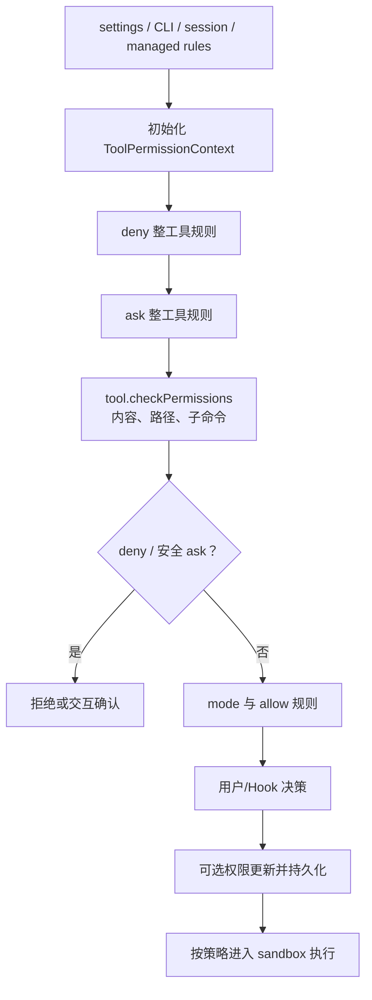

# P08 权限、安全与沙箱

> Claude Code 的安全决策不是一个“是否允许”的布尔值，而是规则来源、匹配优先级、工具自检、运行模式、用户交互、持久化和 OS sandbox 共同组成的分层状态机。

## 学习目标

- 理解 allow/ask/deny 规则从哪里来、怎样合并；
- 掌握一次权限检查的真实优先级；
- 区分 permission mode 与单条规则；
- 理解路径/命令安全检查和 sandbox 的关系；
- 看懂用户批准、更新持久化、headless 拒绝与取消路径。

## 前置知识与范围

前置：P07。

本课只做防御性分析。示例使用无破坏占位命令，不枚举完整危险规则，也不提供绕过权限或 sandbox 的步骤。认证、远程权限桥接分别在 P13、P12。

## 在整体架构中的位置



## 先用 Python 建立最小模型

```python
from dataclasses import dataclass
from enum import Enum

class Behavior(Enum):
    ALLOW = "allow"
    ASK = "ask"
    DENY = "deny"
    PASSTHROUGH = "passthrough"

@dataclass
class Decision:
    behavior: Behavior
    reason: str

def decide(tool: str, action: str, rules: list[tuple[str, str]]) -> Decision:
    if ("deny", tool) in rules:
        return Decision(Behavior.DENY, "deny rule")
    if ("ask", tool) in rules:
        return Decision(Behavior.ASK, "ask rule")

    tool_result = tool_specific_check(tool, action)
    if tool_result.behavior in {Behavior.DENY, Behavior.ASK}:
        return tool_result

    if ("allow", tool) in rules:
        return Decision(Behavior.ALLOW, "allow rule")
    return Decision(Behavior.ASK, "no rule decided")
```

教学简化点：真实实现中 content rule、mode、Hook、headless、auto classifier 和 sandbox 都会继续细化结果；明确枚举比裸布尔值更能保留理由和后续动作。

## Claude Code 的真实实现流程

### 1. 权限规则按来源装入上下文

`initializeToolPermissionContext()` 读取磁盘规则、CLI 的 allowed/disallowed tools、base tools、额外目录与初始 mode，然后构造：

- `alwaysAllowRules`；
- `alwaysDenyRules`；
- `alwaysAskRules`；
- `additionalWorkingDirectories`；
- `mode` 与若干模式可用性状态。

规则保留 `source`，常见来源包括设置层、CLI 参数、command 和 session。`loadAllPermissionRulesFromDisk()` 从当前设置来源取得规则；`applyPermissionRulesToPermissionContext()` 合并到内存状态。managed/policy 限制可以关闭非托管规则能力。

这里的“合并”不是说 allow 可以覆盖 deny。来源决定规则从哪来，真正行为仍由固定决策顺序决定。

### 2. 规则值由“工具名 + 可选内容”组成

`PermissionRule` 的行为是 allow/ask/deny，值包含工具名和可选 `ruleContent`。例如教学占位：

```text
Bash(test-command:*)
Read(./docs/**)
```

整工具规则由 `toolMatchesRule()` 处理；带内容的规则交给工具自己的 `checkPermissions()` 解释。MCP 工具还支持按服务器全限定名匹配，避免与内置工具重名。

### 3. 固定优先级先处理不可绕过项

`hasPermissionsToUseToolInner()` 在 2.1.88 中明确按步骤实现：

1. 整工具 deny；
2. 整工具 ask（某些确认已 sandbox 的 Bash 可以继续下沉细查）；
3. `tool.checkPermissions()` 做输入内容、路径或子命令检查；
4. 工具返回 deny 立即生效；
5. `requiresUserInteraction()` 的 ask 生效；
6. 内容级 ask 规则生效；
7. `safetyCheck` 类型的 ask 生效；
8. 然后才考虑 `bypassPermissions` mode；
9. 再考虑整工具 allow；
10. 无明确结论的 passthrough 转成 ask。

关键结论：bypass mode 也不是在所有检查之前无条件返回 allow；显式 deny、内容 ask 和特定安全检查位于它之前。

### 4. 外层根据 mode 继续转换 ask

`hasPermissionsToUseTool()` 对 inner result 做运行模式处理：

| mode | ask 的典型处理 |
|---|---|
| `default` | 进入交互确认 |
| `acceptEdits` | 工具检查可对工作区安全编辑放行，其它动作仍可能 ask |
| `plan` | 限制执行，并保存进入 plan 前的模式语义 |
| `dontAsk` | ask 转为 deny |
| `bypassPermissions` | 仅在前置不可绕过检查通过后放行 |
| `auto` | feature-gated；部分 ask 进入安全快路径或分类器，受拒绝熔断控制 |

`TRANSCRIPT_CLASSIFIER` 下的 auto mode 是 B 级证据：源码存在复杂分类、拒绝计数、计划模式交互和 circuit breaker，但是否对当前外部构建/账户开放需另行核验。

### 5. 交互层应用并可持久化更新

当结果为 ask，交互 UI 或外部 permission prompt 收集决定。批准可以只针对本次，也可以携带 `PermissionUpdate`：增加规则、改变 mode 或新增目录。

`applyPermissionUpdate(s)` 更新内存 context；`supportsPersistence()` 判断更新能否落盘；`persistPermissionUpdate(s)` 写入对应设置来源。managed-only 策略或不可持久化 destination 会限制这一过程。

headless/异步 Agent 无法展示对话框时，代码先给 `PermissionRequest` hooks 决策机会；仍无决定则保守自动拒绝，而不是假设允许。

### 6. 路径检查是工具权限的一部分

`pathValidation.ts` 与 `filesystem.ts` 负责：

- 展开和规范化路径；
- 判断路径是否位于工作目录或额外允许目录；
- 区分 read/write/create；
- 检查 ignore、敏感内部文件和危险删除目标；
- 生成可解释的建议，而不是仅返回 false。

这些检查发生在工具 `call()` 之前。文件系统规则与 shell 规则各有解析器，不能把字符串前缀匹配当成全部安全模型。

### 7. sandbox 是执行隔离层，不替代权限层

`shouldUseSandbox()` 只有在 sandbox 已启用、命令存在、没有受政策允许的显式 unsandbox override、且命令不在 excluded list 时返回 true。

`SandboxManager` 根据设置构造文件系统、网络和平台运行配置。即使命令会进入 sandbox，仍可能受 ask/deny 规则控制；反之，权限允许也不表示一定有可用 sandbox。两层解决不同问题：

- 权限：用户/组织是否授权这个意图；
- sandbox：已授权代码在操作系统层能触及什么。

## 关键数据结构与状态变化

| 结构 | 责任 |
|---|---|
| `ToolPermissionContext` | 当前模式、三类规则、额外目录和模式能力 |
| `PermissionRule` | 来源、行为、工具名、可选内容 |
| `PermissionResult` | 工具局部判断，可为 passthrough |
| `PermissionDecision` | 全局最终 allow/ask/deny、理由和更新输入 |
| `PermissionUpdate` | 规则、mode、目录的可应用/可持久化变更 |

一次“始终允许”的状态变化是：

```text
ask → 用户允许并选择 destination
→ applyPermissionUpdate(内存)
→ persistPermissionUpdate(允许时落盘)
→ 后续调用重新按固定优先级匹配
```

## 源码锚点

| 文件/符号 | 在流程中的职责 | 建议关注 |
|---|---|---|
| [`src/utils/permissions/permissionSetup.ts: initializeToolPermissionContext`](../claude-code-sourcemap/restored-src/src/utils/permissions/permissionSetup.ts) | 初始规则与 mode | 来源、危险规则处理、额外目录 |
| [`src/utils/permissions/permissionsLoader.ts: loadAllPermissionRulesFromDisk`](../claude-code-sourcemap/restored-src/src/utils/permissions/permissionsLoader.ts) | 从设置读取规则 | managed-only 与来源 |
| [`src/utils/permissions/permissions.ts: hasPermissionsToUseToolInner`](../claude-code-sourcemap/restored-src/src/utils/permissions/permissions.ts) | 固定决策优先级 | deny/ask/safety/bypass/allow |
| [`src/utils/permissions/permissions.ts: hasPermissionsToUseTool`](../claude-code-sourcemap/restored-src/src/utils/permissions/permissions.ts) | mode 与交互转换 | dontAsk、auto、headless |
| [`src/utils/permissions/PermissionUpdate.ts: apply/persistPermissionUpdate`](../claude-code-sourcemap/restored-src/src/utils/permissions/PermissionUpdate.ts) | 更新和持久化 | destination 与支持范围 |
| [`src/utils/permissions/filesystem.ts: checkReadPermissionForTool/checkWritePermissionForTool`](../claude-code-sourcemap/restored-src/src/utils/permissions/filesystem.ts) | 路径安全 | 工作区、敏感路径、建议 |
| [`src/tools/BashTool/shouldUseSandbox.ts: shouldUseSandbox`](../claude-code-sourcemap/restored-src/src/tools/BashTool/shouldUseSandbox.ts) | 单次命令是否进入隔离 | override、excluded command |
| [`src/utils/sandbox/sandbox-adapter.ts: SandboxManager`](../claude-code-sourcemap/restored-src/src/utils/sandbox/sandbox-adapter.ts) | OS sandbox 适配 | 文件、网络、平台差异 |

## 失败路径、安全边界与设计取舍

- 规则解析失败：设置校验应报告问题，不能把无效 deny 静默当 allow。
- 权限询问不可用：headless 默认拒绝，Hook 失败也不会升级为允许。
- 取消：等待用户或分类器期间仍受同一 AbortSignal 控制。
- 敏感路径：部分 `safetyCheck` 位于 bypass/auto 快路径之前。
- sandbox 不可用：是否失败取决于配置策略；不能宣称所有平台都有等价隔离。
- 显式 unsandbox 字段名字带危险提示，而且还必须受组织策略允许。
- 自动分类：属于额外决策层，不应被描述成确定无误的安全证明。

## 动手练习

1. 用 Python 为 `Decision` 增加 `source` 和 `suggestions`，模拟一次 session-only allow。
2. 追踪一个文件写入工具，找出路径校验、权限决策和真实写入的边界。
3. 用无破坏命令 `printf placeholder` 分析：整工具 ask 与内容 allow 同时存在时谁先命中？
4. 解释为什么 sandbox auto-allow 只能针对确认会进入 sandbox 的调用。

## 小结与检查题

1. 规则来源优先级与 allow/deny 决策优先级为何不是一回事？
2. 哪些检查发生在 bypass mode 之前？
3. `passthrough` 为什么最终通常转成 ask？
4. 权限允许与 sandbox 隔离分别解决什么问题？
5. headless 环境无法询问用户时为什么应默认拒绝？

## 版本与证据说明

- 快照版本：2.1.88。
- A 级：规则加载、inner 权限步骤、更新持久化、路径检查、sandbox 选择均可由自有源码与 bundle 验证。
- B 级：`TRANSCRIPT_CLASSIFIER` auto mode、部分 PowerShell 和平台 sandbox 路径受 feature/build/provider 控制。
- 易漂移的模式、默认值和安全规则应以 2.1.88 快照为准；本课没有继承旧文档中的规则数量。
