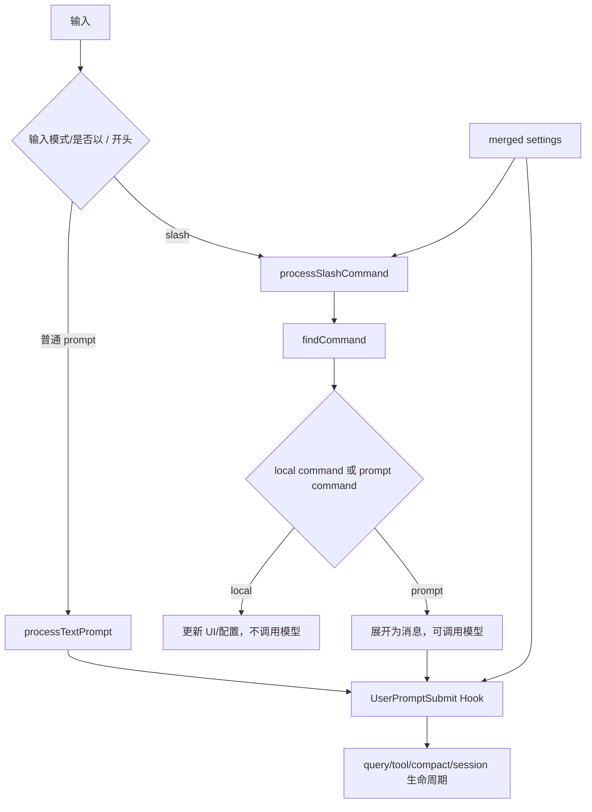

# P09 命令、配置与 Hook

> Slash command 决定“这次输入怎样被解释”，settings 决定“会话采用什么策略”，Hook 决定“生命周期事件发生时允许哪些扩展响应”；三者彼此组合，但不是同一种扩展机制。

## 学习目标

- 区分自然语言、slash command、Skill 和 Tool；
- 追踪 `/command args` 的注册、查找和执行；
- 理解多来源 settings 的读取、校验与合并；
- 掌握 Hook 的匹配、执行、阻断和异步回收；
- 看懂设置变更后的缓存失效与状态重算。

## 前置知识与范围

前置：P01、P03、P07。Skill、Plugin 和 MCP 在 P10 展开。

本课不逐个介绍内置命令，也不提供可执行的高风险 Hook 示例。Hook 是本地扩展代码，始终按用户/项目/组织信任边界理解。

## 在整体架构中的位置



## 先用 Python 建立最小模型

```python
from dataclasses import dataclass
from typing import Callable, Literal

@dataclass
class Command:
    name: str
    kind: Literal["local", "prompt"]
    run: Callable[[str], dict]

def dispatch(text: str, commands: dict[str, Command]) -> dict:
    if not text.startswith("/"):
        return {"should_query": True, "message": text}

    name, _, args = text[1:].partition(" ")
    command = commands.get(name)
    if command is None:
        return {"should_query": False, "error": f"unknown command: {name}"}
    return command.run(args)

def merge_settings(low: dict, high: dict) -> dict:
    result = dict(low)
    for key, value in high.items():
        if isinstance(result.get(key), list) and isinstance(value, list):
            result[key] = list(dict.fromkeys([*result[key], *value]))
        elif isinstance(result.get(key), dict) and isinstance(value, dict):
            result[key] = merge_settings(result[key], value)
        else:
            result[key] = value
    return result
```

教学简化版保留两个核心事实：命令结果显式决定是否询问模型；设置是从低到高深合并，数组有专门的合并规则。

## Claude Code 的真实实现流程

### 1. 输入分派发生在 Agent loop 之前

`processUserInput()` 根据输入模式进入文本、Bash 或 slash 路径。它在基础处理完成且 `shouldQuery=true` 后运行 `UserPromptSubmit` hooks；若 Hook 阻断，则返回系统警告并不进入 `query()`。

远程输入可以设置 `skipSlashCommands`，避免远端文本触发本地命令；只有明确列入 bridge-safe 的命令有受控例外。这是客户端边界，而不是字符串解析细节。

### 2. 命令注册表来自多个来源

`loadAllCommands()` 并行加载：

- skills 目录、bundled skills 和内置 plugin skills；
- plugin commands / plugin skills；
- workflow commands（feature-gated）；
- 内置 `COMMANDS()`。

`getCommands(cwd)` 缓存昂贵的磁盘加载，但每次重新判断 availability 和 `isEnabled()`，使登录/provider 状态变化可以及时反映。动态发现的 Skill 会去重并插入合适位置。

因此“slash command 注册表”是统一查找表，但其中成员的来源与执行语义不同。

### 3. `processSlashCommand()` 明确区分未知、local 与 prompt

处理步骤是：

1. `parseSlashCommand()` 拆出 command name 和 args；
2. `hasCommand/findCommand` 查当前有效注册表；
3. 对真正未知且像命令的输入返回错误，不调用模型；
4. 调用 `getMessagesForSlashCommand()`；
5. 根据返回的 messages 和 `shouldQuery` 决定结束本地操作还是进入 Agent loop；
6. 可附带 allowedTools、model、effort 或 nextInput 等本轮覆盖。

local command 常用于 UI、认证、配置或会话操作，可以返回空 messages；prompt command/Skill 则把内容展开成模型消息。Slash command 自身不是模型 tool call。

### 4. settings 来源先校验，再按低到高合并

`loadSettingsFromDisk()` 以 plugin settings 为最低优先级基础，再遍历启用的 setting sources。普通来源读取 JSON 后通过 schema 校验；flag settings 还可合并 SDK inline settings。

policy settings 有特殊的“选择一个有效管理源”规则，优先顺序在源码中明确为 remote、管理员 MDM、managed files、HKCU fallback；选中的 policy 再进入总合并链。

`settingsMergeCustomizer()` 对数组采用连接后去重，其它值交给 deep merge。后加载的高优先级标量覆盖低优先级；嵌套 permissions/sandbox/hooks 继续按结构合并。

### 5. settings 缓存与变更必须成对处理

`getSettingsWithErrors()` 使用会话缓存减少 I/O；文件变更或 UI 修改后需要 `resetSettingsCache()`。`getSettingsWithSources()` 会主动清缓存，保证 effective 与各 raw source 来自同一时刻。

`applySettingsChange()` 不只是改 JSON：它还重新计算受影响的 permission context、mode 与运行状态。Hooks 配置有独立 snapshot；外部编辑后 `updateHooksConfigSnapshot()` 同样先刷新 settings cache，避免执行旧配置。

### 6. Hook 先匹配来源和事件，再执行具体后端

`getMatchingHooks()` 根据事件、matcher、来源和当前 app/session state 选出 Hook。`executeHooks()` 是 REPL 内的生成器路径，可产出进度和模型可见结果；`executeHooksOutsideREPL()` 用于 session end、compact 等不直接流式展示的场景。

Hook 后端不只有 shell command：源码还包含 prompt、agent、HTTP 和程序注册函数等路径，但不同事件/构建支持范围不同。HTTP Hook 额外经过 URL/环境变量 allowlist 和 SSRF 防护。

### 7. 生命周期结果具有不同阻断语义

| 事件 | 时点 | 可能影响 |
|---|---|---|
| `UserPromptSubmit` | 用户消息进入 query 前 | 阻断或补充上下文 |
| `PreToolUse` | 权限与工具 call 前 | 更新输入、允许/阻断 |
| `PermissionRequest` | 权限询问阶段 | headless 或交互决策 |
| `PostToolUse` / failure | 工具完成/失败后 | 补充结果、报告错误 |
| `Stop` / `SubagentStop` | Agent 准备停止 | 要求继续或给出反馈 |
| `PreCompact` / `PostCompact` | 压缩事务边界 | 增加摘要指令、通知 |
| `SessionStart` / `SessionEnd` | 会话开始/退出 | 初始化、清理、审计 |
| `ConfigChange` | 配置文件变化 | 审计或阻断非 policy 变更 |

policy settings 的 ConfigChange Hook 只用于审计，不能被普通 Hook 阻断，这是管理策略优先于项目扩展的安全边界。

### 8. 异步 Hook 要登记并在安全点回收

`AsyncHookRegistry` 记录后台进程、输出位置和状态；`checkForAsyncHookResponses()` 收集完成结果并转成附件；成功交付后 `removeDeliveredAsyncHooks()` 清理登记；会话结束时 `finalizePendingAsyncHooks()` 等待或终止残留工作。

这避免“启动后台命令后忘记它”，也让结果通过标准消息管线进入后续 turn。

## 关键数据结构与状态变化

| 结构 | 责任 |
|---|---|
| `Command` | 名称、来源、可用性和 local/prompt 行为 |
| `ProcessUserInputBaseResult` | messages、`shouldQuery` 与本轮覆盖 |
| `SettingsJson` | schema 校验后的配置形状 |
| `SettingsWithSources` | effective 配置和低→高来源快照 |
| `HookInput` | event name、session、cwd 和事件字段 |
| `HookResult` / `AggregatedHookResult` | 输出、阻断、更新输入与权限决定 |
| `PendingAsyncHook` | 异步 Hook 生命周期记录 |

## 源码锚点

| 文件/符号 | 在流程中的职责 | 建议关注 |
|---|---|---|
| [`src/utils/processUserInput/processUserInput.ts: processUserInput`](../claude-code-sourcemap/restored-src/src/utils/processUserInput/processUserInput.ts) | 输入总分派 | Hook 前置与远程安全 |
| [`src/utils/processUserInput/processSlashCommand.tsx: processSlashCommand`](../claude-code-sourcemap/restored-src/src/utils/processUserInput/processSlashCommand.tsx) | slash 执行 | 未知/local/prompt 分支 |
| [`src/commands.ts: getCommands`](../claude-code-sourcemap/restored-src/src/commands.ts) | 命令注册表 | 多来源、缓存、动态 Skill |
| [`src/utils/settings/settings.ts: loadSettingsFromDisk`](../claude-code-sourcemap/restored-src/src/utils/settings/settings.ts) | settings 加载合并 | 来源、policy、校验错误 |
| [`src/utils/settings/settings.ts: settingsMergeCustomizer`](../claude-code-sourcemap/restored-src/src/utils/settings/settings.ts) | 数组合并语义 | 去重与 deep merge |
| [`src/utils/settings/applySettingsChange.ts: applySettingsChange`](../claude-code-sourcemap/restored-src/src/utils/settings/applySettingsChange.ts) | 变更落地 | 状态重算与副作用 |
| [`src/utils/hooks.ts: getMatchingHooks/executeHooks`](../claude-code-sourcemap/restored-src/src/utils/hooks.ts) | Hook 匹配执行 | 信任、超时、阻断 |
| [`src/utils/hooks/AsyncHookRegistry.ts: finalizePendingAsyncHooks`](../claude-code-sourcemap/restored-src/src/utils/hooks/AsyncHookRegistry.ts) | 异步 Hook 清理 | 收集、交付、退出 |

## 失败路径、安全边界与设计取舍

- 未知 slash command：不应误当已注册扩展执行；像路径的文本有专门兼容处理。
- settings JSON/schema 错误：收集并去重错误，同时继续处理其它来源。
- 缓存过期：变更路径必须刷新 settings/commands/hooks 各自缓存。
- Hook 超时/非零退出：按事件语义记录、阻断或降级，不把任意输出都视为成功。
- 项目 Hook 信任：未信任目录可跳过 Hook；managed Hook 不能被低权限设置关闭。
- HTTP Hook：限制 URL 与可展开环境变量，并做 SSRF 防护。
- 取消/退出：异步 Hook 在 session end 需要 finalize，避免孤儿进程和结果丢失。

## 动手练习

1. 用 Python 实现一个 local `/theme` 和 prompt `/review`，观察 `should_query` 差异。
2. 给三个 settings source 合并同一标量、嵌套对象和数组，写出 effective 结果。
3. 从 `processUserInput()` 追踪一个阻断型 `UserPromptSubmit` Hook。
4. 解释远程输入为何默认不执行本地 slash command。

## 小结与检查题

1. Slash command 与 Tool 的调用者分别是谁？
2. local command 为什么可以不进入模型？
3. settings 数组和标量的合并行为有何不同？
4. 为什么变更 settings 后只写文件还不够？
5. Hook 的 blocking result 为什么必须按事件解释？

## 版本与证据说明

- 快照版本：2.1.88。
- A 级：输入分派、command 注册/执行、settings 合并、主要 Hook 生命周期与异步清理可由源码和 bundle 验证。
- B 级：workflow commands、部分 Hook 后端和内部命令受 feature/build/provider 限制。
- 本课没有把 command、Skill、Plugin、MCP tool 和内置 Tool 混为一类；它们的组合关系在 P10 收束。
