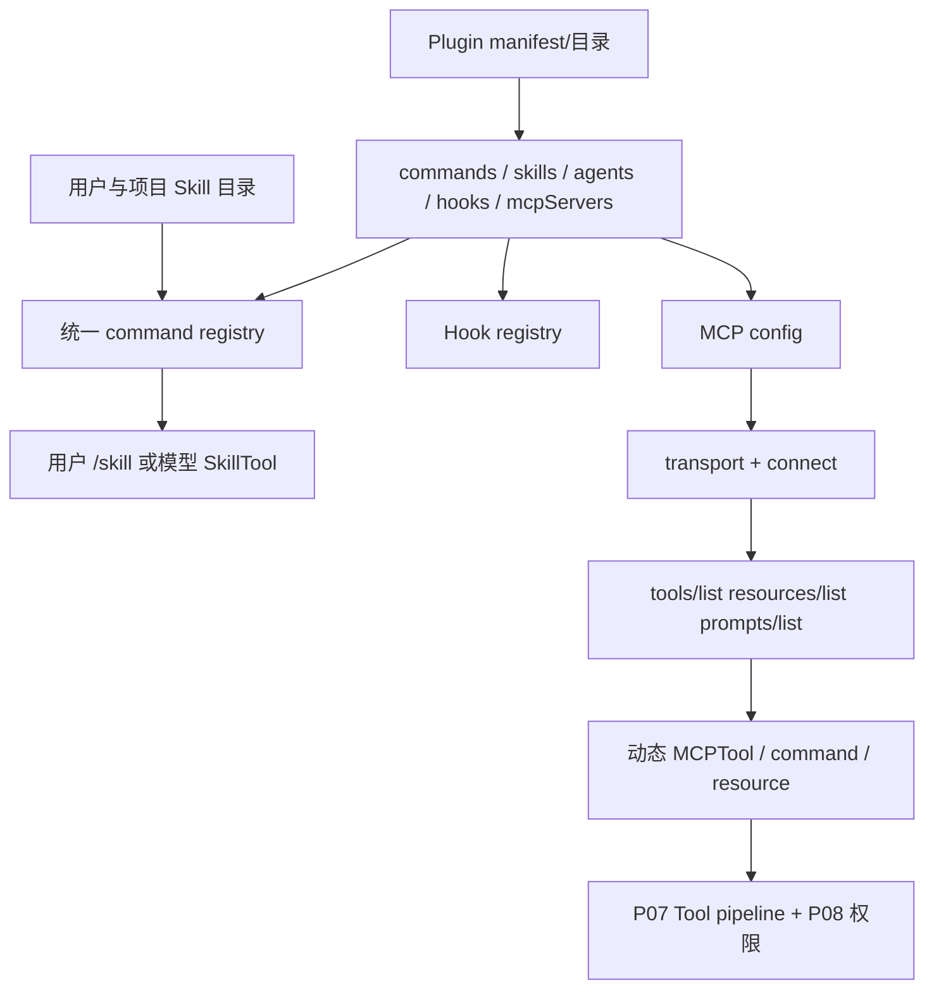

# P10 MCP、Skill 与 Plugin 扩展

> Plugin 是能力包装与分发容器，Skill 是可被用户或模型调用的指令工作流，MCP 是跨进程/网络发现工具、资源和 prompts 的协议；它们最终通过 command、Tool、Hook 等既有接口接入 Claude Code。

## 学习目标

- 准确区分 Plugin、Skill、MCP、slash command 和内置 Tool；
- 追踪 Skill 从目录加载到用户/模型调用；
- 追踪 MCP 从配置、传输、能力发现到 Tool 适配；
- 理解 Plugin 如何组合 commands、skills、agents、hooks 和 MCP servers；
- 掌握扩展失败时的隔离、权限和认证边界。

## 前置知识与范围

前置：P07、P09。MCP OAuth 的协议细节与 provider 认证属于 P13；子 Agent/forked Skill 属于 P11；远程 transport 的整体信任边界属于 P12。

本课描述 2.1.88 客户端源码，不把第三方 MCP/Plugin 的行为视为 Claude Code 自有实现。`MCP_SKILLS`、远程 Skill 搜索等 feature-gated 路径只按 B 级证据表述。

## 在整体架构中的位置

| 机制 | 本质 | 谁触发 | 最终接入点 |
|---|---|---|---|
| 内置 Tool | 编译进客户端的结构化能力 | 模型 `tool_use` | `Tool` 执行流水线 |
| slash command | 输入分派命令 | 用户 `/name` | local 操作或 prompt message |
| Skill | Markdown 指令工作流与元数据 | 用户 slash 或模型 `Skill` Tool | command registry / Tool |
| Plugin | 可安装的扩展容器 | 启动加载/管理命令 | commands、skills、agents、hooks、MCP 等 |
| MCP | 外部能力协议 | 客户端连接后由模型调用 | 动态 `MCPTool`、resource/command adapter |



## 先用 Python 建立最小模型

```python
from dataclasses import dataclass, field

@dataclass
class Skill:
    name: str
    instructions: str
    allowed_tools: list[str] = field(default_factory=list)

@dataclass
class Plugin:
    name: str
    skills: list[Skill] = field(default_factory=list)
    commands: list[str] = field(default_factory=list)
    hooks: dict[str, list[str]] = field(default_factory=dict)
    mcp_servers: dict[str, dict] = field(default_factory=dict)

async def discover_mcp_tools(client) -> list[dict]:
    capabilities = await client.initialize()
    if "tools" not in capabilities:
        return []
    remote_tools = await client.request("tools/list")
    return [adapt_to_local_tool(tool) for tool in remote_tools]
```

教学简化点：Plugin 自己不是运行时协议；它把多个已有扩展点打包。MCP tool 只有完成远端 schema 到本地 `Tool` 的适配后，才能复用 P07/P08 流水线。

## Claude Code 的真实实现流程

### 1. Skill 首先被表示成一种 `Command`

`getSkillDirCommands()` 扫描启用的 Skill 路径；`parseSkillFrontmatterFields()` 解析名称、描述、允许工具、模型、是否 fork 等元数据；`createSkillCommand()` 把 Markdown 内容包装为 prompt-type `Command`。

来源可以是 user/project/local skills、bundled、Plugin，或动态发现目录。加载器做路径优先级、重名去重、frontmatter 校验和缓存。失败 Skill 通常被记录并跳过，不应让整个 CLI 无法启动。

### 2. 用户和模型通过不同入口调用同一 Skill 内容

用户输入 `/name args` 时走 P09 的 `processSlashCommand()`。模型调用 Skill 时走 `SkillTool`：

1. schema 接收 `skill` 和可选 args；
2. `validateInput()` 去除兼容性的前导 `/`，从当前 commands（含 MCP skills）查找；
3. 检查该 command 是否允许模型调用；
4. inline Skill 把 prompt 展开进主会话；
5. 声明 fork 的 Skill 可转交子 Agent 执行并回传文本结果。

所以 Skill 不是任意函数调用。它主要提供可复用指令、资源引用和本轮工具/模型约束；真实副作用仍由后续 Tool 调用并经过权限系统。

### 3. Plugin loader 先建立可信的组件清单

`createPluginFromPath()` 是组装中心：

- 从 `.claude-plugin/plugin.json` 读取 manifest，缺失时可用受限默认；
- 检查标准目录及 manifest 声明的 commands、agents、skills、output styles；
- 读取和合并 hooks 配置；
- 保留 MCP server 声明和其它元数据；
- 对缺失组件记录结构化错误，而不是把任意路径当有效能力。

`validatePluginManifest()` / `validatePluginContents()` 负责 schema、路径和内容验证。`loadAllPlugins()` 合并安装来源与缓存结果；启用/禁用、managed policy、blocklist 和依赖解析会进一步过滤有效集合。

### 4. Plugin 组件分别进入已有注册表

Plugin 不建立第二套 Agent runtime：

- `getPluginCommands()` / `getPluginSkills()` 进入 `getCommands()`；
- `loadPluginHooks()` 注册到 Hook 配置；
- agent definitions 进入 P11 的 Agent 加载；
- `loadPluginMcpServers()` / `getPluginMcpServers()` 转成标准 MCP configs；
- output styles 和 settings 进入各自现有系统。

这一设计让权限、取消、遥测和错误处理可以复用，而不要求每个 Plugin 自己实现。

### 5. MCP 配置先按 scope 与 policy 汇总

`getAllMcpConfigs()` / `getClaudeCodeMcpConfigs()` 合并用户、项目、local、enterprise、Plugin、Claude.ai/SDK 等来源，`filterMcpServersByPolicy()` 应用组织限制，dedup 函数按签名处理等价服务器。

配置记录 server name、scope 和 transport 参数。关闭的 server 在发现阶段直接产生 disabled 状态，不建立网络连接。

### 6. `connectToServer()` 根据 transport 建立连接

2.1.88 的源码包含 stdio、SSE、Streamable HTTP、WebSocket、IDE、SDK in-process、Claude.ai proxy 等分支。不同 transport 的信任边界不同：

- stdio 会启动本地进程；
- HTTP/SSE/WS 跨网络，需 header、proxy、TLS 和 timeout；
- SDK server 可在进程内建立 transport；
- OAuth token、静态 header 和 session ingress token 有明确选择与脱敏日志路径。

长连接 SSE 不复用单请求 timeout，避免固定时限误杀事件流。连接错误被映射为 `failed`、`needs-auth` 等状态，而不是让全部服务器初始化失败。

### 7. 能力发现后转换成本地抽象

`getMcpToolsCommandsAndResources()` 对 active servers 分组并限制并发：本地进程型与远端网络型使用不同 batch size。连接成功后并行获取：

- `fetchToolsForClient()`；
- `fetchCommandsForClient()`；
- resources；
- feature-gated MCP skills。

服务器没有声明相应 capability 时返回空集合。单个服务器失败只回报该连接失败和空能力，其它服务器继续。

### 8. MCP tool 被适配为标准 `Tool`

`fetchToolsForClient()` 请求 `tools/list`，清理服务端返回数据，并以 `MCPTool` 模板构造每个动态工具：

- 默认名称为 `mcp__server__tool`，保存原始 `mcpInfo`；
- 使用远端 input JSON Schema；
- description 有长度限制；
- `readOnlyHint` 用于只读与并发提示；
- destructive/open-world annotation 转成本地风险元数据；
- `checkPermissions()` 先返回 passthrough，由 P08 统一规则决定；
- `call()` 通过 MCP client 发请求，再转换远端 content/structuredContent。

服务端 annotation 是提示，不是绝对安全证明；本地权限规则仍是授权边界。

### 9. OAuth 与 elicitation 是协议边界，不是工具权限替代品

HTTP/SSE 连接可能进入 `needs-auth` 并暴露专门认证工具；`performMCPOAuthFlow()` 完成授权码流程和 token 保存。工具调用还可能返回 elicitation 请求，由专门 handler 和重试路径处理。

认证回答“能否代表用户连接服务”，权限回答“本次工具动作是否获准”，两者不可合并。

## 关键数据结构与状态变化

| 状态/类型 | 变化 |
|---|---|
| `LoadedPlugin` | manifest + 已验证组件路径 + 来源 + errors |
| `Command` | Skill/command 进入统一注册表 |
| `ScopedMcpServerConfig` | 配置携带 scope/policy 信息 |
| `MCPServerConnection` | disabled/connecting/connected/needs-auth/failed |
| MCP capabilities | 决定是否请求 tools/resources/prompts |
| dynamic `Tool` | 远端 schema/annotations 映射到本地契约 |

一次 MCP 正常路径：

```text
config → policy filter → transport connect → initialize capabilities
→ tools/list → MCPTool adapter → tool pool
→ 模型 tool_use → 本地权限 → MCP call
→ result transform → tool_result → query 继续
```

## 源码锚点

| 文件/符号 | 在流程中的职责 | 建议关注 |
|---|---|---|
| [`src/skills/loadSkillsDir.ts: getSkillDirCommands/createSkillCommand`](../claude-code-sourcemap/restored-src/src/skills/loadSkillsDir.ts) | Skill 发现和 Command 适配 | frontmatter、来源、缓存 |
| [`src/tools/SkillTool/SkillTool.ts: SkillTool`](../claude-code-sourcemap/restored-src/src/tools/SkillTool/SkillTool.ts) | 模型调用 Skill | 校验、inline/fork |
| [`src/utils/plugins/pluginLoader.ts: createPluginFromPath/loadAllPlugins`](../claude-code-sourcemap/restored-src/src/utils/plugins/pluginLoader.ts) | Plugin 组装 | manifest、组件错误、来源 |
| [`src/utils/plugins/loadPluginCommands.ts: getPluginCommands/getPluginSkills`](../claude-code-sourcemap/restored-src/src/utils/plugins/loadPluginCommands.ts) | Plugin 接入 command registry | 命名、元数据、去重 |
| [`src/utils/plugins/mcpPluginIntegration.ts: loadPluginMcpServers`](../claude-code-sourcemap/restored-src/src/utils/plugins/mcpPluginIntegration.ts) | Plugin MCP 配置适配 | manifest 与 `.mcp.json` |
| [`src/services/mcp/config.ts: getAllMcpConfigs/filterMcpServersByPolicy`](../claude-code-sourcemap/restored-src/src/services/mcp/config.ts) | MCP 配置合并治理 | scope、dedup、managed policy |
| [`src/services/mcp/client.ts: connectToServer`](../claude-code-sourcemap/restored-src/src/services/mcp/client.ts) | transport 与连接状态 | auth、timeout、失败隔离 |
| [`src/services/mcp/client.ts: getMcpToolsCommandsAndResources`](../claude-code-sourcemap/restored-src/src/services/mcp/client.ts) | 能力发现 | capability、分组并发 |
| [`src/services/mcp/client.ts: fetchToolsForClient`](../claude-code-sourcemap/restored-src/src/services/mcp/client.ts) | MCP → Tool 适配 | schema、annotation、命名 |
| [`src/tools/MCPTool/MCPTool.ts: MCPTool`](../claude-code-sourcemap/restored-src/src/tools/MCPTool/MCPTool.ts) | 动态工具模板 | passthrough 权限与结果映射 |

## 失败路径、安全边界与设计取舍

- Skill frontmatter/文件错误：隔离单个 Skill，清缓存后可重新发现。
- Plugin manifest/组件缺失：返回结构化 errors，不能把未验证路径注册为能力。
- MCP server disabled：不连接；needs-auth：提供认证状态；failed：不拖垮其它服务器。
- transport 取消/超时：单请求 timeout 与长连接生命周期分开。
- 外部 schema/content：先清理与限制，再进入本地 Tool/message；远端 description 不应无限注入 prompt。
- annotation：只用于调度/风险提示，本地权限仍需执行。
- OAuth token/header：日志脱敏，凭据持久化由认证模块管理。
- Plugin Hook/stdio MCP：可执行本地代码或进程，必须受项目信任、安装来源与 managed policy 约束。

## 动手练习

1. 为 Python `Plugin` 添加一个 MCP server 和 Skill，画出它们分别进入哪个注册表。
2. 比较用户 `/review` 与模型 `Skill({skill: "review"})` 的入口和共同内容。
3. 为假想只读 MCP 工具写 adapter，说明为何仍不能直接跳过权限。
4. 模拟三个 MCP server：connected、needs-auth、failed，验证单点失败不会清空其它工具。

## 小结与检查题

1. Plugin 为什么是容器而不是新的执行协议？
2. Skill 与 slash command 的关系是什么？
3. MCP capability discovery 为什么必须在连接后进行？
4. MCP 的 `readOnlyHint` 为什么不能替代本地权限？
5. OAuth 成功为什么不等于每次 MCP 工具调用都已授权？

## 版本与证据说明

- 快照版本：2.1.88。
- A 级：本地 Skill、Plugin 组件加载、MCP config/transport/tool discovery、MCPTool 适配和权限接入可由源码与公共 bundle 验证。
- B 级：`MCP_SKILLS`、远程/动态 Skill 搜索、部分 transport 与内置 Plugin 受 feature、provider、账户或运行模式控制。
- C 级边界：source map 不包含第三方 MCP server 或 Plugin 的内部实现，课程不推断其服务端行为。
