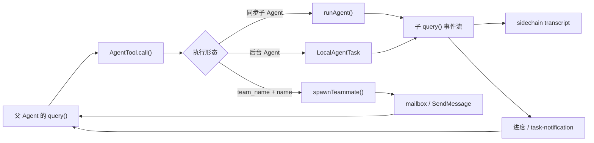

# P11 子 Agent、后台任务与多 Agent 协作

> 子 Agent 不是“又调一次模型”这么简单；它是一个有独立消息、工具、权限、取消信号和 transcript（转录）的 Agent 循环，再由任务层把进度与结果带回主会话。

## 学习目标

学完本课，你应能：

- 区分同步子 Agent、后台 Agent、teammate（团队成员）和 coordinator（协调者）；
- 说清父子 Agent 哪些状态继承，哪些状态隔离；
- 追踪 `AgentTool.call()` 到 `runAgent()`、`query()`、任务通知的主链；
- 理解前台转后台、取消、失败、恢复和消息续投的语义；
- 识别 feature flag（功能开关）与当前公共行为的证据边界。

## 前置知识与范围

建议先学 P04 的 `query()` 循环、P07 的工具契约和 P08 的权限决策。

本课主讲本地子 Agent 的完整生命周期，并以 Agent Teams 说明多 Agent 通信。不详讲 MCP 工具如何建立连接（P10），不展开远程 CCR/Bridge 的网络协议（P12），也不把 feature-gated 的 coordinator/swarm 路径当成所有用户的默认模式。

## 在整体架构中的位置



心智模型是：`AgentTool` 决定“启动哪种 worker”，`runAgent` 构造子环境并复用核心 `query()`，`LocalAgentTask` 管理可观测生命周期，transcript 为续投与恢复提供持久证据。

## 先用 Python 建立最小模型

下面是可运行的教学简化版。`asyncio.Queue` 对应运行中的续投消息，`Event` 对应取消信号；真实实现使用 `AbortController`、React/Ink 状态和 transcript 文件。

```python
import asyncio
from dataclasses import dataclass, field
from enum import Enum


class Status(str, Enum):
    RUNNING = "running"
    COMPLETED = "completed"
    FAILED = "failed"
    KILLED = "killed"


@dataclass
class AgentTask:
    task_id: str
    prompt: str
    status: Status = Status.RUNNING
    inbox: asyncio.Queue[str] = field(default_factory=asyncio.Queue)
    cancelled: asyncio.Event = field(default_factory=asyncio.Event)
    transcript: list[str] = field(default_factory=list)


async def worker(task: AgentTask) -> str:
    task.transcript.append(task.prompt)
    for step in range(3):
        if task.cancelled.is_set():
            task.status = Status.KILLED
            return "partial result"
        while not task.inbox.empty():
            task.transcript.append(await task.inbox.get())
        await asyncio.sleep(0)
        task.transcript.append(f"step:{step}")
    task.status = Status.COMPLETED
    return "final result"
```

这个模型保留了四个关键事实：工作者有自己的历史；运行中可收到新信息；取消不等于“从未执行”；结果通过任务状态返回，而不是直接篡改父 Agent 的消息列表。

## Claude Code 的真实实现流程

### 1. `AgentTool` 先解析执行形态

`AgentTool.call()` 先读取当前权限与 Agent 定义，再根据输入分流：

- `team_name` 与 `name` 同时存在时，转到 `spawnTeammate()`；
- 显式 `subagent_type` 选定对应 Agent 定义；
- 未给 `subagent_type` 时，fork 实验开启则走继承完整上下文的 fork 路径，否则回落到 general-purpose；
- `run_in_background`、Agent 定义的 `background`、coordinator 等条件共同决定是否异步。

选型不是纯 UI 逻辑：被 `Agent(Type)` deny 规则拒绝的 Agent 不可启动；需要的 MCP server 未准备好时，还会等待或失败。

### 2. 上下文继承是有选择的

`runAgent()` 并不复制父会话的整个运行时对象。

| 类别 | 真实行为 |
|---|---|
| 消息 | 普通子 Agent 从自己的 prompt 开始；fork 路径可携带过滤后的父消息 |
| 未完整工具调用 | `filterIncompleteToolCalls()` 移除未配对调用，避免 API 协议错误 |
| 文件读取缓存 | fork 时克隆；非 fork 时新建有容量限制的缓存 |
| 工具池 | 根据 Agent 定义解析；特定 fork 路径可保持精确工具集 |
| 权限 | 可有 Agent 专属 mode；显式 SDK CLI 规则保留，父会话 session allow 规则不无条件泄漏 |
| `AbortController` | 同步子 Agent 默认共享父取消器；后台 Agent 默认使用独立取消器 |
| UI 状态 | 同步路径可共享部分回调；异步路径使用隔离上下文 |

因此，“继承”更像经过策略的投影，而不是深拷贝。

### 3. 子 Agent 内部仍运行 `query()`

`runAgent()` 创建 Agent 专属 system prompt、user/system context、MCP client 和工具池，然后构造 `ToolUseContext`，最终消费同一套 `query()` 异步事件流。

主 Agent 和子 Agent 共享核心循环实现，但不等于共享一份会话状态。子 Agent 产生的可记录消息被写入 sidechain transcript，完成后再收集为 Agent 结果。

### 4. 前台转后台是生命周期转换

一个同步 Agent 可先被 `registerAgentForeground()` 登记。`AgentTool` 在读取子事件时，同时等待 `backgroundSignal`：

1. 子 Agent 先完成：收集结果，移除前台任务登记。
2. 用户或自动计时器先触发：把 `isBackgrounded` 设为 `true`，返回“已在后台运行”，原循环由后台 closure 继续消费。
3. 后台完成、失败或取消：更新 task state，写输出文件，入队 `<task-notification>`。

转后台不是重启 Agent；同一条流继续运行，只是结果交付方式改变。

### 5. Task 是通用生命周期外壳

`tasks/types.ts` 把 local shell、local agent、remote agent、in-process teammate 等组成联合类型。对 Agent 而言，任务对象持有：

- `taskId/agentId`、描述、起止时间和状态；
- 进度统计、最近工具活动与摘要；
- `AbortController` 与清理回调；
- 待续投消息、是否后台化、是否已通知；
- 结果、错误与输出文件路径。

`completeAgentTask()` 和 `failAgentTask()` 只在任务仍为 `running` 时转移状态，避免晚到的完成事件覆盖已取消状态。

### 6. 运行中续投与恢复是两条路

`SendMessageTool` 对本地 Agent 先查 `agentNameRegistry`：

- 任务仍在运行：`queuePendingMessage()` 把文本放入队列，等下一个工具轮次吸收；
- 任务已停止：`resumeAgentBackground()` 从磁盘 transcript 重建消息和 content-replacement state，再附加新 prompt；
- 内存 task 已清理：仍可尝试根据 Agent ID 找 transcript 恢复；
- transcript 不存在：明确失败，不虚构上下文。

恢复前还会清理空白 assistant message、孤立 thinking 和未解决 tool use，防止将不合法的历史再次发给 API。

### 7. Teammate 通信不是共享消息数组

Agent Teams 路径通过 team file 维护 roster（成员名册），通过 mailbox 发送初始指令和后续消息。`SendMessageTool` 支持定向、广播、关闭请求/应答与 plan approval 等结构化消息。

名册是平的：teammate 不能再创建有名 teammate，避免丢失父子来源。in-process teammate 的生命周期又绑定 leader 进程，因而禁止它启动后台 Agent。这些是明确的约束，不是 UI 建议。

## 关键数据结构与状态变化

| 状态/标识 | 所有者 | 作用 |
|---|---|---|
| `agentId` | Agent 执行与 transcript | 串起任务、输出、续投和恢复 |
| `LocalAgentTaskState` | 根 `AppState.tasks` | 表示运行/完成/失败/取消和前后台属性 |
| `pendingMessages` | 单个本地 Agent task | 在工具轮次边界注入后续指令 |
| sidechain transcript | session storage | 隔离记录子 Agent 事件，支持查看与恢复 |
| team file | team helpers | 维护 leader/member 名册和路由信息 |
| mailbox | teammate mailbox | 在隔离的 Agent 之间交付消息 |

最小状态机可写成：

```text
pending -> running_foreground -> completed
             |                    failed
             +-> running_background -> killed
                                      -> completed/failed

stopped/completed/failed + transcript + new prompt -> running_background
```

## 源码锚点

> 以下相对路径均从本课文件所在的 `courses/` 目录出发；需先生成 `restored-src/`。

| 文件/符号 | 在流程中的职责 | 建议关注 |
|---|---|---|
| [`tools/AgentTool/AgentTool.tsx: AgentTool`](../claude-code-sourcemap/restored-src/src/tools/AgentTool/AgentTool.tsx) | 选择 Agent、分流同步/异步/teammate/fork | gate、deny 规则、前台转后台 |
| [`tools/AgentTool/runAgent.ts: runAgent`](../claude-code-sourcemap/restored-src/src/tools/AgentTool/runAgent.ts) | 创建子上下文并运行 `query()` | 消息、工具、权限、取消与 transcript |
| [`utils/forkedAgent.ts: createSubagentContext`](../claude-code-sourcemap/restored-src/src/utils/forkedAgent.ts) | 统一子 Agent 隔离/共享策略 | 默认 clone 与显式 override |
| [`tasks/LocalAgentTask/LocalAgentTask.tsx: registerAgentForeground`](../claude-code-sourcemap/restored-src/src/tasks/LocalAgentTask/LocalAgentTask.tsx) | 登记、后台化、进度、完成与取消 | 状态转移和晚到事件 |
| [`tools/AgentTool/resumeAgent.ts: resumeAgentBackground`](../claude-code-sourcemap/restored-src/src/tools/AgentTool/resumeAgent.ts) | 从 sidechain transcript 恢复 Agent | 历史清理、worktree 回落、元数据 |
| [`tools/SendMessageTool/SendMessageTool.ts: SendMessageTool`](../claude-code-sourcemap/restored-src/src/tools/SendMessageTool/SendMessageTool.ts) | 运行中续投、恢复、mailbox 和结构化协作 | 路由顺序与失败回复 |
| [`tools/shared/spawnMultiAgent.ts: spawnTeammate`](../claude-code-sourcemap/restored-src/src/tools/shared/spawnMultiAgent.ts) | 创建 teammate、注册 roster、发送初始 mailbox 消息 | in-process 与外部 pane 后端 |
| [`tasks/stopTask.ts: stopTask`](../claude-code-sourcemap/restored-src/src/tasks/stopTask.ts) | 统一停止任务 | not found/not running/unsupported 失败分类 |

## 失败路径、安全边界与设计取舍

### 取消是协作式传播

`killAsyncAgent()` 调用任务的 `AbortController.abort()`，并将 task 标记为 killed。下层 API/工具需要观察 signal 才能停止，所以取消不是进程时间倒流。后台 shell 等子资源还需在 `runAgent()` 的 `finally` 清理。

### 后台 Agent 不能依赖当前权限弹窗

默认异步 Agent 会设置 `shouldAvoidPermissionPrompts`，因为它未必有可交互 UI。特定 bubble 模式可把请求带回父终端，但也要先等自动检查。这是一条信任边界，不应通过复制父 session allow 规则绕过。

### 恢复不保证原环境完整存在

worktree 被外部删除时，恢复会回落到父 cwd；Agent 定义消失时可回落到 general-purpose。这些是可用性取舍，也意味着“同 ID 恢复”不等于完全重现原运行环境。

### 并发不是所有调用的默认语义

只有异步任务或团队/coordinator 路径才产生可独立推进的 worker。不能仅因一条 assistant message 含多个 tool use，就断言它们必然并行。

## 动手练习

1. 在 Python 模型中添加 `FAILED`分支，验证失败后的续投必须显式走“恢复”，不能直接放入原 inbox。
2. 从 `AgentTool.call()` 出发，分别列出同步、`run_in_background=true`、`team_name + name` 三条路径的第一个不同调用点。
3. 阅读 `resumeAgentBackground()`，说明为什么不能将原 transcript 原样再发给 API。
4. 设计一个不依赖真实文件系统的测试，验证“killed 任务不会被晚到 completed 事件覆盖”。

## 小结与检查题

本课的一句话模型是：子 Agent 是“隔离的 `query()` + 可管理的 Task + 可恢复的 transcript”，多 Agent 协作再在其上增加名册与 mailbox。

检查题：

1. 为什么说 fork 的上下文继承仍然是“投影”？
2. 同步子 Agent 和后台 Agent 的取消器默认有何不同？
3. 前台转后台为什么不是重启？
4. 运行中续投与 transcript 恢复各在什么情况下发生？
5. teammate 为什么不等于共享父 Agent 的 messages 数组？

## 版本与证据说明

- 快照版本：`@anthropic-ai/claude-code` 2.1.88；`cli.js --version` 已核验。
- A 级：公共 bundle 包含后台 Agent 启动、任务状态、取消、sidechain transcript 与恢复相关实现；source map 符号与公共 `cli.js` 中对应文案可交叉核验。
- B 级：fork subagent 受 `feature('FORK_SUBAGENT')` 与动态 gate 影响；coordinator 受 `feature('COORDINATOR_MODE')` 与环境变量影响；Agent Teams 需显式 opt-in/资格判定。源码包含这些路径，不能据此断言对所有 2.1.88 用户默认开放。
- 快照不包含完整官方 monorepo 和服务端调度实现；本课只描述可由客户端 source map 验证的状态与边界。
