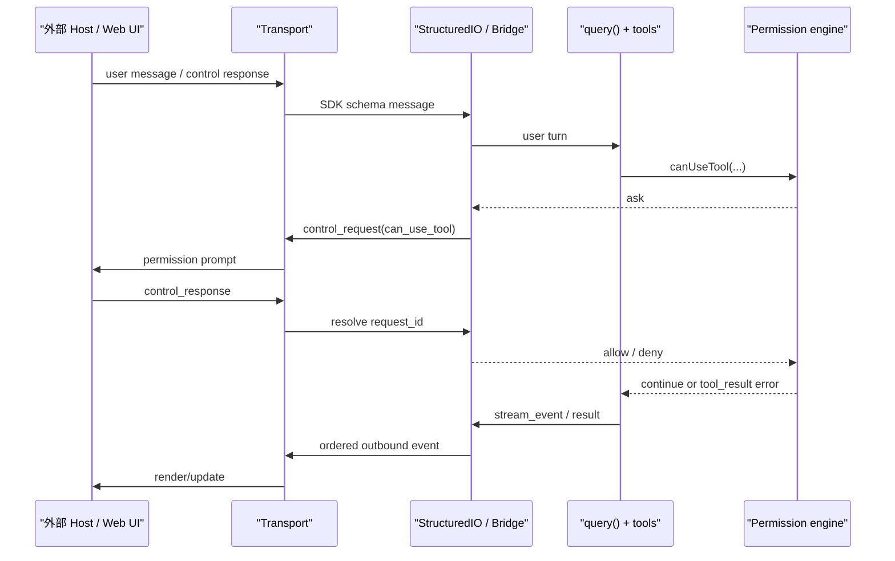

# P12 远程会话、Bridge 与外部客户端

> 远程模式的核心不是“把终端画面传出去”，而是把用户消息、Agent 事件、控制请求和权限答复变成可校验、可恢复、可取消的协议流。

## 学习目标

学完本课，你应能：

- 区分 TUI、`stream-json` SDK、Remote Session 和 REPL Bridge 的驱动方式；
- 解释 NDJSON 数据面与 `control_request/control_response` 控制面；
- 追踪一次远程工具权限请求的往返路径；
- 理解 WebSocket、SSE + HTTP POST 和 Hybrid transport 的分工；
- 说清断线重连、重放去重、取消和 fail-closed 边界。

## 前置知识与范围

建议先学 P03 的消息层次、P04 的 Agent 循环、P08 的权限决策和 P11 的任务生命周期。

本课讲客户端内的协议适配、传输与权限桥接。不讲 Anthropic 服务端内部调度，不假设 source map 包含 CCR 后端，不把 Remote Control 的 feature-gated 代码路径解读成全量发布承诺。

## 在整体架构中的位置



这张图的重点是：外部客户端不直接调用某个本地工具函数。它发送结构化意图，客户端内核仍负责 schema 校验、请求关联、取消和权限决策转换。

## 先用 Python 建立最小模型

下面是可运行的教学简化版。它演示“发出带 ID 的控制请求，等待对应响应”；真实实现还包含 Zod schema、hook 竞速、连接状态和网络传输。

```python
import asyncio
import uuid
from dataclasses import dataclass


@dataclass
class ControlRequest:
    request_id: str
    subtype: str
    payload: dict[str, object]


class StructuredChannel:
    def __init__(self) -> None:
        self.outbound: asyncio.Queue[ControlRequest] = asyncio.Queue()
        self.pending: dict[str, asyncio.Future[dict[str, object]]] = {}

    async def request(self, subtype: str, payload: dict[str, object]):
        request_id = str(uuid.uuid4())
        future = asyncio.get_running_loop().create_future()
        self.pending[request_id] = future
        await self.outbound.put(ControlRequest(request_id, subtype, payload))
        try:
            return await future
        finally:
            self.pending.pop(request_id, None)

    def receive_response(self, request_id: str, result: dict[str, object]):
        future = self.pending.get(request_id)
        if future and not future.done():
            future.set_result(result)
```

`request_id` 将并发请求与响应配对；`finally` 是清理边界；真实实现中的 `AbortSignal` 还会主动发出 `control_cancel_request`，使另一端能关闭过期 UI。

## Claude Code 的真实实现流程

### 1. 外部接入分为数据面与控制面

`StructuredIO` 读取按行分隔的 JSON（NDJSON）并通过 SDK schema 解析。普通 user/assistant/result/stream event 属于数据面；下列消息属于控制面：

- `control_request`：权限请求、interrupt、设置 model/mode、MCP 操作、hook callback、停止任务等；
- `control_response`：对 `request_id` 的成功或错误响应；
- `control_cancel_request`：请求已被本地 hook、取消或另一通道解决，远端应收起待处理 UI。

`StructuredIO.outbound` 是单写入队列：`print.ts` 的流事件与控制请求先入队，再由同一 drain loop 顺序写出，防止权限请求越过先前已产生的 stream event。

### 2. 权限桥接仍先跑本地决策

`StructuredIO.createCanUseTool()` 先调用 `hasPermissionsToUseTool()`。若结果已是 allow 或 deny，无需询问外部 host。只有 ask 结果才转换为 `can_use_tool` 控制请求。

此时会并发启动两个候选决策：

1. `PermissionRequest` hook；
2. SDK/Bridge 宿主的权限弹窗。

谁先给出确定决策就使用谁。hook 先决定时，本地会 abort SDK 请求并发 cancel；SDK 先响应时，hook 的晚到结果被忽略。这是明确的竞速，不是两次授权。

### 3. 断流与取消都会收敛 pending request

`StructuredIO` 用 `Map<request_id, PendingRequest>` 保存等待者。

- 输入流关闭：拒绝所有 pending request，避免 Agent 永久等待；
- 父 `AbortSignal` 触发：发 `control_cancel_request`，立即以 `AbortError` 拒绝本地 Promise；
- 带错误的 response：拒绝对应等待者；
- 响应 schema 不合法：解析失败，不将任意对象当作权限决策。

沙箱网络请求复用 `can_use_tool` 协议的合成工具名。如果远端流关闭或响应失败，返回 `false`，即 fail closed（失败时拒绝）。

### 4. Remote Session Manager 管理“看与说”两条通道

`RemoteSessionManager` 的职责很聚焦：

- 通过 `SessionsWebSocket` 订阅 SDK message、权限请求和 cancel；
- 通过 HTTP API 向远程会话发 user message；
- 用自己的 pending-permission map 保留等待 UI 决策的请求；
- 对不支持的 control subtype 主动发 error response，避免服务端无限等待；
- viewer-only 模式不发送中断，也不以普通编辑者的方式更新会话。

当远程 CCR 请求的工具在本地不存在（例如远程特有 MCP 工具），`createToolStub()` 创建仅用于权限 UI 的最小工具描述。它不把执行能力偷渡到本地；真正的工具运行仍在远程环境。

### 5. Transport 隐藏网络差异，不改变 SDK 消息协议

| 传输 | 读取 | 写入 | 恢复关键 |
|---|---|---|---|
| `WebSocketTransport` | WebSocket | WebSocket | ping/keepalive、发送缓冲、指数退避 |
| `SSETransport` | Server-Sent Events | HTTP POST | `Last-Event-ID`/序号高水位、liveness timeout |
| `HybridTransport` | 继承 WebSocket 读 | 串行化 HTTP batch POST | 关闭前 drain，写入顺序与超时 |

SSE 和 WebSocket 都区分暂时断线与永久拒绝。401/403/404 或特定 WebSocket close code 不做无限重连；暂时失败采用有上限的指数退避和总时间预算。

### 6. 序号高水位防止换传输时全量重放

REPL Bridge 更换 JWT/epoch 或 transport 时，先读取旧 transport 的最后序号，再传给新 SSE transport。新连接从高水位继续，而不是每次从 0 请求全部历史。

`StructuredIO` 另外保留有界的 resolved tool-use ID 集合，忽略断线重放导致的晚到/重复权限响应。如果重复响应再次注入 assistant message，下一次 API 调用会看到重复 tool-use ID，因此去重是协议正确性，不只是性能优化。

### 7. Bridge 是双向适配器，不是权限绕行道

REPL Bridge 把本地流事件写入远程 session ingress，也把远程 user/control message 注入本地 REPL/StructuredIO。当权限请求被远程 Web UI 解决，Bridge 用 `injectControlResponse()` 唤醒本地等待者，同时 cancel SDK host 的过期弹窗。

传输可以跨网络，但是权限决策仍通过同一套结构化 allow/deny 结果回到工具管线。不存在“连上 Bridge 就默认允许所有工具”的语义。

## 关键数据结构与状态变化

| 对象 | 状态所有者 | 关键不变量 |
|---|---|---|
| `StructuredIO.pendingRequests` | 本地 SDK IO | 一个 `request_id` 最终只解决一次 |
| `outbound` | `StructuredIO` | 单 drain writer 保持消息顺序 |
| `pendingPermissionRequests` | `RemoteSessionManager` | UI 只能回复存在且待处理的请求 |
| transport state | 各 transport 实例 | idle/connecting/connected/reconnecting/closing/closed 受控转移 |
| sequence high-water mark | SSE/Bridge transport | 换连接后从已处理位置继续 |
| session/access token | 认证/传输层 | 用于连接身份，不是工具权限结果 |

## 源码锚点

> 以下路径需先生成 `restored-src/`。

| 文件/符号 | 在流程中的职责 | 建议关注 |
|---|---|---|
| [`cli/structuredIO.ts: StructuredIO`](../claude-code-sourcemap/restored-src/src/cli/structuredIO.ts) | NDJSON 解析、请求配对、权限与 hook 桥接 | pending map、单写队列、cancel/去重 |
| [`entrypoints/sdk/controlSchemas.ts`](../claude-code-sourcemap/restored-src/src/entrypoints/sdk/controlSchemas.ts) | SDK 控制面的运行时 schema | subtype 联合、response/error 外壳 |
| [`remote/RemoteSessionManager.ts: RemoteSessionManager`](../claude-code-sourcemap/restored-src/src/remote/RemoteSessionManager.ts) | 远程会话订阅、发送与权限回复 | viewer-only、未知 subtype 错误 |
| [`remote/remotePermissionBridge.ts`](../claude-code-sourcemap/restored-src/src/remote/remotePermissionBridge.ts) | 为远程权限 UI 构造合成 message/tool | 显示适配与真实执行边界 |
| [`cli/transports/WebSocketTransport.ts`](../claude-code-sourcemap/restored-src/src/cli/transports/WebSocketTransport.ts) | WebSocket 连接、缓冲、心跳与重连 | 永久 close code、sleep detection |
| [`cli/transports/SSETransport.ts`](../claude-code-sourcemap/restored-src/src/cli/transports/SSETransport.ts) | SSE 读 + HTTP POST 写 | Last-Event-ID、liveness、重连预算 |
| [`cli/transports/HybridTransport.ts`](../claude-code-sourcemap/restored-src/src/cli/transports/HybridTransport.ts) | WebSocket 读 + 批量 HTTP 写 | 串行化、backpressure、close drain |
| [`bridge/replBridgeTransport.ts: createV2ReplTransport`](../claude-code-sourcemap/restored-src/src/bridge/replBridgeTransport.ts) | 适配 Bridge v1/v2 transport | epoch、序号续接、delivery ack |
| [`bridge/bridgeEnabled.ts: isBridgeEnabled`](../claude-code-sourcemap/restored-src/src/bridge/bridgeEnabled.ts) | 构建开关、账户资格与动态 gate | 功能存在不等于默认可用 |

## 失败路径、安全边界与设计取舍

### 信任边界有三层

1. 本地进程边界：文件系统、工具和本地权限规则。
2. 传输边界：session token/JWT/epoch 确保连接属于对应会话。
3. 用户决策边界：远程 UI 只回复某个 `request_id/tool_use_id`，不直接执行本地工具。

将传输认证成功误解为工具授权成功，会混淆这三层。

### 重连需要同时处理重复与丢失

只重连不够：必须保留序号高水位、输出队列和已解决 ID。否则要么丢掉断线窗口的事件，要么重放已处理的权限响应。

### 关闭顺序影响最终结果是否可见

Hybrid/Bridge 路径中，最终 result 先入写队列，再 archive/drain，最后 close。过早 close 会让队列在下一次检查时停止，导致结果静默丢失。这是异步系统中典型的“清理也是业务流程”。

## 动手练习

1. 给 Python `StructuredChannel` 添加 `cancel(request_id)`，要求取消后的晚到 response 被忽略。
2. 从 `createCanUseTool()` 画出 hook 先返回与 SDK 先返回的两条分支，标注 loser 如何被取消/忽略。
3. 比较 `WebSocketTransport` 和 `SSETransport` 的永久失败判定，说明为什么认证失败不应持续重连。
4. 阅读 `createToolStub()`，说明它为什么不代表远程工具被加载到本地。

## 小结与检查题

本课的一句话模型是：外部客户端通过结构化协议驱动同一个 Agent 内核，Transport 解决送达与恢复，StructuredIO/Bridge 解决顺序、关联、权限和取消。

检查题：

1. `control_request` 为什么必须有 `request_id`？
2. hook 与 SDK 权限弹窗竞速时，如何保证只有一个决策生效？
3. 序号高水位与 resolved-ID 集合分别解决什么问题？
4. 传输 token 为什么不能替代工具权限决策？
5. 为什么 close 之前需要 drain 输出队列？

## 版本与证据说明

- 快照版本：`@anthropic-ai/claude-code` 2.1.88。
- A 级：SDK `stream-json`、`StructuredIO`、`control_request/control_response/control_cancel_request`、权限失败时收敛和 transport 重连实现可在 source map 与公共 `cli.js` 中交叉核验。
- B 级：Remote Control/REPL Bridge 受 `feature('BRIDGE_MODE')`、claude.ai 订阅身份、profile scope、组织信息和 GrowthBook gate 共同控制；Bridge v2、auto-connect 与 mirror 还有独立 gate。
- C 级边界：快照只显示客户端期望的服务端协议，不足以证明 CCR 后端内部实现、数据保留策略或全量发布状态。
