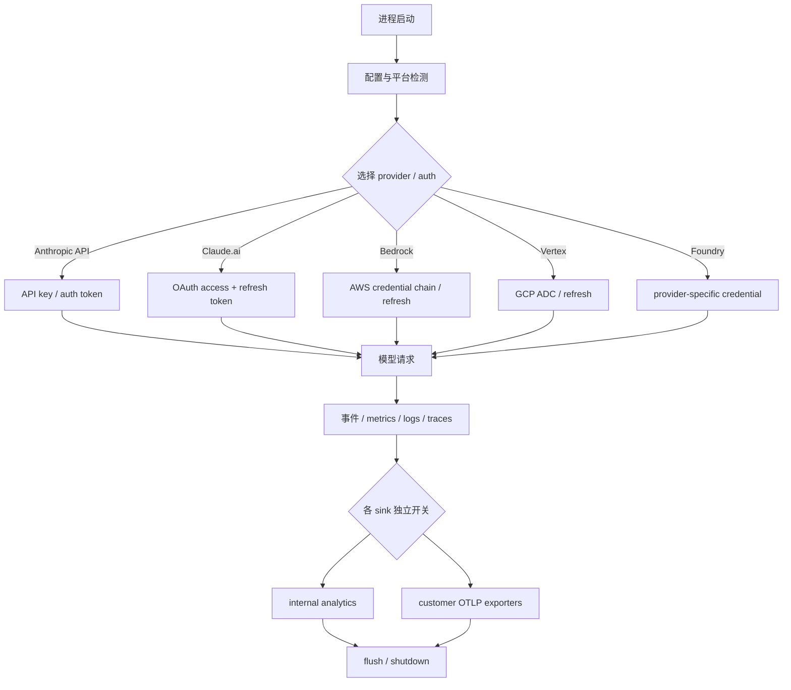

# P13 认证、平台适配与可观测性

> 一个可长时间运行的 Agent 客户端，必须在每次请求前回答“用哪种身份、走哪个 provider”，在运行中回答“发生了什么”，并在退出时把凭据与观测数据安全收尾。

## 学习目标

学完本课，你应能：

- 区分 Anthropic API key、Claude.ai OAuth、Bedrock、Vertex 和 Foundry 的认证路径；
- 解释凭据来源选择、安全存储、缓存、过期刷新与 401 恢复；
- 区分内部 analytics（产品分析）与用户配置的 OpenTelemetry 导出；
- 理解采样、killswitch（紧急停用开关）、批量导出与 flush/shutdown；
- 说清平台检测、native 加速与 settings migration 的支撑作用。

## 前置知识与范围

建议先学 P01 的初始化顺序和 P05 的 provider/API 请求层。

本课不展示任何真实 token、API key、用户标识或内部遥测载荷；不讲服务端认证策略；不把注释中的产品名或 gate 当成上线承诺。平台部分只讲运行时适配责任，不深入 vendor 二进制内部。

## 在整体架构中的位置



认证与可观测是横切层：它们支撑每一次 Agent/API 调用，但都不是模型推理本身。

## 先用 Python 建立最小模型

下面是可运行的教学简化版，把“凭据来源”表达为明确联合，避免用一个可空字符串混淆 API key 和 OAuth token。

```python
from dataclasses import dataclass
from enum import Enum


class Provider(str, Enum):
    ANTHROPIC = "anthropic"
    BEDROCK = "bedrock"
    VERTEX = "vertex"
    FOUNDRY = "foundry"


@dataclass(frozen=True)
class ApiKeyAuth:
    source: str
    key: str


@dataclass(frozen=True)
class OAuthAuth:
    access_token: str
    refresh_token: str | None
    expires_at: int | None


@dataclass(frozen=True)
class ProviderCredentials:
    provider: Provider
    source: str


Auth = ApiKeyAuth | OAuthAuth | ProviderCredentials


def choose_auth(provider: Provider, api_key: str | None) -> Auth:
    if provider is Provider.BEDROCK:
        return ProviderCredentials(provider, "aws credential chain")
    if provider is Provider.VERTEX:
        return ProviderCredentials(provider, "gcp application default credentials")
    if provider is Provider.FOUNDRY:
        return ProviderCredentials(provider, "foundry credential")
    if api_key:
        return ApiKeyAuth("environment", api_key)
    raise RuntimeError("Anthropic credential required")
```

教学重点是：provider 先决定凭据家族；OAuth 的 refresh token 是可选的，因为环境变量或文件描述符传入的 inference-only token 不能自行刷新。

## Claude Code 的真实实现流程

### 1. Provider 选择先分开认证世界

`isAnthropicAuthEnabled()` 明确将 Bedrock、Vertex 和 Foundry 归为第三方 provider 路径。启用它们时，不应再落入 Claude.ai OAuth 选择。

| provider | 主凭据家族 | 客户端关注点 |
|---|---|---|
| Anthropic API | `ANTHROPIC_API_KEY`、apiKeyHelper、文件描述符或受管 key | 来源优先级、用户批准、缓存 |
| Claude.ai | OAuth access/refresh token | scope、过期、安全存储、跨进程刷新 |
| Bedrock | AWS credential chain/自定义 refresh/export | STS 缓存、workspace trust、缓存清理 |
| Vertex | GCP Application Default Credentials/自定义 refresh | 有界有效性探测、缓存与 trust |
| Foundry | Foundry/provider-specific 凭据 | 与 Claude.ai OAuth 分流，详细 API 组装属 P05 |

这个表格是客户端路由图，不是服务端认证协议的完整说明。

### 2. 凭据来源选择避免“便利回落”破坏隔离

`getAuthTokenSource()` 与 `getAnthropicApiKeyWithSource()` 不只返回值，还返回 source。这使上层能区分环境变量、helper、受管存储和无凭据。

几个重要边界：

- `--bare` 模式是封闭选择：不读 OAuth、keychain 和普通配置文件；
- managed OAuth context（CCR/Claude Desktop）不回落到用户终端里的 `apiKeyHelper` 或 API key 设置；
- CI/test 路径若既没有 API key 也没有 OAuth token，显式失败；
- helper 缓存暂冷时，仍保留 source=`apiKeyHelper`，不偷偷回落到 keychain。

最后一点非常关键：“暂时还没取到值”不等于“这个来源没配置”。

### 3. OAuth 存储与 inference-only token 有明确分界

`saveOAuthTokensIfNeeded()` 只持久化适用于 Claude.ai auth scope 且带 refresh token/过期时间的 token。由环境变量或文件描述符传入的 inference-only token：

- 在内存中表示为只含 access token；
- `refreshToken` 和 `expiresAt` 为 `null`；
- scope 限定为 inference；
- 不写入安全存储，也不能用于需要 profile scope 的功能。

对于可持久化 token，实现通过 `getSecureStorage()` 抽象平台差异，而不将 token 放在进程命令行参数中。写入后会清理 auth/beta/tool-schema 缓存，使新身份在后续请求中生效。

### 4. Token 刷新需要处理同进程与跨进程竞态

`checkAndRefreshOAuthTokenIfNeeded()` 的流程可概括为：

1. 检查凭据文件修改时间，必要时清理当前进程缓存；
2. 同一进程中复用 in-flight Promise，合并并发刷新检查；
3. 再次异步读安全存储，确认没有其他进程已经刷新；
4. 获取跨进程 lock，获锁后再检查一次；
5. 只在 token 仍过期时调用 refresh，保存新 token 并清缓存；
6. 无论成败释放 lock。

服务端返回 401 时，`handleOAuth401Error()` 不盲信本地过期时钟。它先清缓存，再比较失败 token 和安全存储中的当前 token：若已不同，说明另一进程可能已刷新；若仍相同，才强制刷新。

### 5. AWS/GCP 自定义 refresh 命令必须受 trust 边界约束

Bedrock 路径支持 AWS auth refresh 与 credential export，Vertex 路径支持 GCP auth refresh。这些配置可能触发外部命令，因此代码区分它们是否来自 project/local settings，并只在 workspace trust 已建立时预取。

GCP 凭据有效性探测有短超时，AWS/GCP refresh 和缓存也都有明确 TTL/清理点。这些机制减少每请求外部调用，但不能以跳过 trust 为代价。

### 6. Analytics 先入队，再由 sink 路由

`services/analytics/index.ts` 提供稳定的 `logEvent()` 入口。analytics sink 尚未初始化时，事件暂存在内存队列；`attachAnalyticsSink()` 完成后排空早期事件。这避免初始化早期的认证/启动事件因为后端尚未准备而必然丢失。

`sink.ts` 再做三层决策：

1. 按事件名采样；
2. 检查 Datadog/first-party 的紧急 killswitch 与 gate；
3. 对不同 sink 使用不同元数据投影，普通后端不接收仅允许进入特权列的字段。

这也是为什么 analytics metadata 的普通类型主要允许布尔值和数字：用类型层减少误传代码、文件路径或自由文本的风险。

### 7. 内部 analytics 与用户 OTLP 是两套管线

`utils/telemetry/instrumentation.ts` 使用 OpenTelemetry 组装 metrics、logs 和 traces。需要区分：

- first-party analytics：受全局 opt-out、provider/流量策略、采样和 killswitch 管理；
- customer telemetry：只在 `CLAUDE_CODE_ENABLE_TELEMETRY` 显式开启时，按 `OTEL_*_EXPORTER` 选择 console/OTLP/Prometheus 等导出；
- beta/perfetto tracing：是独立调试路径，不能与普通产品事件混为一谈。

SDK `stream-json` 使用 stdout 作为机器协议通道，因此初始化会移除 console exporter：否则 exporter 的格式化输出会混入 NDJSON，破坏外部 SDK 解析。这是“可观测性不能破坏业务协议”的典型例子。

### 8. Flush 和 shutdown 是正常生命周期

Telemetry provider 使用 batch processor，事件并非每次立即发送。退出、logout 或组织切换时需要 `forceFlush()`/`shutdown()`，否则会丢数据，或把旧组织的待发数据带入新身份。

清理本身有超时，且将多个 provider 的 flush/shutdown 并发组合，避免一个慢 exporter 无限阻塞进程退出。

### 9. 平台层将环境差异变成显式能力

`getPlatform()` 将 Darwin、Windows、Linux/WSL 映射为稳定联合，WSL 通过 `/proc/version` 识别；`getLinuxDistroInfo()` 以容错方式读 `/etc/os-release`。上层因此不需要在每个功能里重复猜测平台。

`native-ts/` 为颜色差异、文件索引和 layout 等提供本地实现/适配；`migrations/` 则把旧配置键或旧 model 名称迁移到当前语义。它们不是 Agent 循环，却保证循环在不同系统和升级路径上看到稳定输入。

## 关键数据结构与状态变化

| 对象 | 所有者 | 主要变化 |
|---|---|---|
| API key source | auth resolver | none/helper/env/managed source 之间按模式选择 |
| OAuth tokens | secure storage + auth cache | loaded -> expired -> locked refresh -> saved/failed |
| AWS/GCP credential cache | provider auth helpers | valid -> expired/invalid -> trusted refresh -> cleared |
| analytics queue | analytics facade | pre-init queued -> sink attached -> drained |
| sink gate/killswitch | analytics routing | enabled/sampled -> exported；disabled -> dropped |
| OTel providers | telemetry instrumentation | initialized -> batched -> flushed -> shutdown |
| platform result | memoized platform helper | 首次检测后稳定复用 |

## 源码锚点

> 以下路径需先生成 `restored-src/`。

| 文件/符号 | 在流程中的职责 | 建议关注 |
|---|---|---|
| [`utils/auth.ts: isAnthropicAuthEnabled`](../claude-code-sourcemap/restored-src/src/utils/auth.ts) | 区分 Claude auth 与第三方 provider | managed context、bare mode、外部凭据 |
| [`utils/auth.ts: getAuthTokenSource`](../claude-code-sourcemap/restored-src/src/utils/auth.ts) | 选择 bearer token 来源 | 优先级与不回落约束 |
| [`utils/auth.ts: checkAndRefreshOAuthTokenIfNeeded`](../claude-code-sourcemap/restored-src/src/utils/auth.ts) | OAuth 过期检查和跨进程刷新 | 双重检查、lock、缓存失效 |
| [`services/oauth/client.ts: refreshOAuthToken`](../claude-code-sourcemap/restored-src/src/services/oauth/client.ts) | token endpoint 交换/刷新与 profile 补全 | scope、旧 refresh token 保留、错误记录 |
| [`services/analytics/index.ts: logEvent`](../claude-code-sourcemap/restored-src/src/services/analytics/index.ts) | analytics facade 与早期队列 | sink 附加前后的行为 |
| [`services/analytics/sink.ts: initializeAnalyticsSink`](../claude-code-sourcemap/restored-src/src/services/analytics/sink.ts) | 采样、Datadog 和 first-party 路由 | 字段投影、gate、killswitch |
| [`services/analytics/firstPartyEventLogger.ts: is1PEventLoggingEnabled`](../claude-code-sourcemap/restored-src/src/services/analytics/firstPartyEventLogger.ts) | first-party 事件的 opt-out 与批处理 | 与 customer telemetry 的隔离 |
| [`utils/telemetry/instrumentation.ts: initializeTelemetry`](../claude-code-sourcemap/restored-src/src/utils/telemetry/instrumentation.ts) | OTel metrics/logs/traces 组装与清理 | exporter、resource、stream-json 冲突、超时 |
| [`utils/platform.ts: getPlatform`](../claude-code-sourcemap/restored-src/src/utils/platform.ts) | macOS/Windows/Linux/WSL 检测 | 容错、memoize、WSL 标记 |
| [`migrations/`](../claude-code-sourcemap/restored-src/src/migrations) | 旧设置和 model 名称的单向迁移 | 幂等性与版本漂移 |

## 失败路径、安全边界与设计取舍

### 凭据存在不等于凭据可用

source 检测可以不执行 helper，以避免 workspace trust 前运行任意命令。因此“hasToken/source exists”和“已取到可用 secret”是两个状态。调用者必须在安全时点预取或 await helper。

### 刷新失败不应破坏旧元数据

OAuth profile 获取可能因短暂网络错误失败。保存新 token 时，代码会尽量保留旧 subscription/rate-limit 元数据，而不用一次临时 `null` 覆盖有效信息。

### 遥测是多条独立数据管线

“关闭 customer OTLP”、“first-party analytics opt-out”、“某个 sink killswitch”与“某个事件未被采样”不是同一件事。课程或排障时应说清具体管线，不用“遥测开/关”一个布尔值概括全部行为。

### 可观测性必须有资源上限

事件队列、batch size、export interval、采样和 shutdown timeout 都是资源边界。缺少这些上限时，观测后端的故障可能反过来阻塞 Agent 或导致内存无界增长。

### Migration 应单向且可重入

发布包中的 migration 要处理旧 key、旧 model 名称和一次性 opt-in 状态。它们不应每次启动来回改写，也不应在未能理解新格式时破坏原配置。快照缺少完整测试集，因此本课只将“单向/幂等”作为应验证的工程不变量，不声称所有 migration 已动态测试。

## 动手练习

1. 扩展 Python `choose_auth()`，加入 OAuth，并保证 Bedrock/Vertex/Foundry 永远不返回 OAuth 类型。
2. 用两个并发 coroutine 模拟 token 刷新，通过一个共享 Future 保证只执行一次 refresh。
3. 从 `logEvent()` 追踪到 Datadog 和 first-party sink，标出采样、killswitch 和字段过滤的顺序。
4. 解释为什么 `stream-json` 模式不能使用 console telemetry exporter。
5. 选一个 `migrations/` 文件，写出其输入、输出与第二次运行应保持的不变量。

## 小结与检查题

本课的一句话模型是：认证层先根据 provider 与运行模式选择受限的凭据来源，可观测层再通过可采样、可停用、可批处理的独立管线观察系统，平台与迁移层保证这些语义跨环境稳定。

检查题：

1. 为什么 Bedrock/Vertex/Foundry 不应回落到 Claude.ai OAuth？
2. helper 来源已配置但缓存为空时，为什么不应继续查 keychain？
3. OAuth refresh 为什么在获得跨进程锁后还要再读一次 token？
4. internal analytics 和 customer OTLP telemetry 的开关为什么不能合并理解？
5. flush/shutdown 为什么同时关系数据完整性和身份隔离？

## 版本与证据说明

- 快照版本：`@anthropic-ai/claude-code` 2.1.88；版本已通过发布包 CLI 核验。
- A 级：Anthropic API key/OAuth 来源选择、Bedrock/Vertex/Foundry 分流、OAuth 安全存储与刷新、analytics sink、OTel 导出与 shutdown 均可在当前 source map 和公共 bundle 对应实现/文案中核验。
- B 级：具体 analytics gate、sampling config、BigQuery 资格、beta tracing 与部分 provider 特殊路径受账户、环境或动态配置控制；应表述为“源码包含，实际启用受条件约束”。
- 默认 TTL、超时、采样率、export interval 和 provider 支持都是易漂移事实；本课刻意聚焦机制，不将快照数字当成长期 API 承诺。
